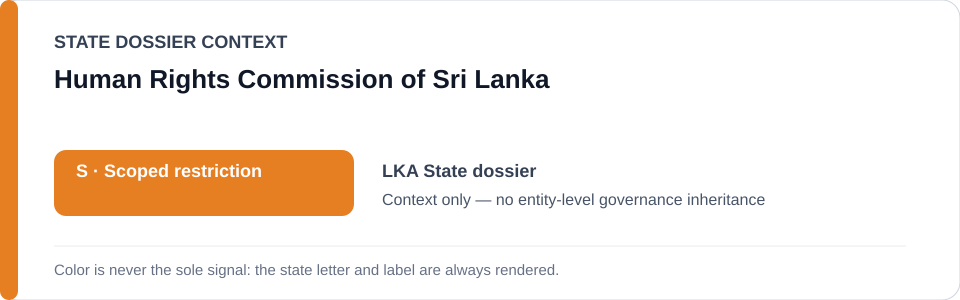
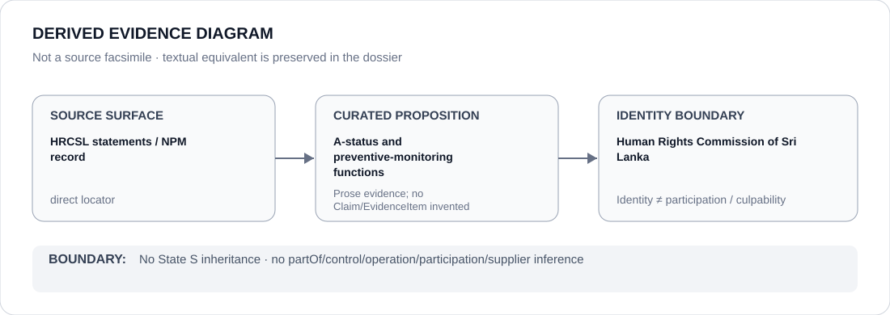

# Human Rights Commission of Sri Lanka

> **Canonical per-entity evidence/provenance record.** This dossier has no licensing effect by itself and carries no standalone `provisional_outcome`.

## Identity scope

The Human Rights Commission of Sri Lanka (HRCSL), represented as the national human-rights institution and National Preventive Mechanism referenced in the canonical Sri Lanka dossier.

## State governance context

The canonical `LKA` State dossier currently records **S — Scoped restriction**. That status is shown below as **context only**. It is not inherited by the Human Rights Commission of Sri Lanka.

## Evidence record

- The Sri Lanka State dossier records that HRCSL retains `A`-status and National Preventive Mechanism functions.
- It treats HRCSL/NPM work as counter-evidence and expressly excludes independent HRCSL/NPM remedial activity from the active scoped restriction.
- HRCSL's statements/general-recommendations surface is preserved by the State dossier as a current institutional locator.

## Attribution and exclusions

This dossier does not establish that every HRCSL intervention is effective, does not attribute PTA/counterterrorism, detention, torture or surveillance conduct to HRCSL, and does not assign HRCSL a standalone `S` outcome.

## Visual evidence

The diagram is derived from curated repository prose and locators; it is not a source facsimile and does not increase evidentiary weight.

## Evidence gaps

This dossier does not yet decompose individual HRCSL statements, inspections or recommendations into proposition-specific structured Claim/EvidenceItem records.

## Sources

- [HRCSL — statements and general recommendations](https://www.hrcsl.lk/documentation/statements-general-recommendations/)
- [Canonical State dossier provenance](../states/LKA.md)

## Governance boundary

Identity, oversight functions, citation or visual adjacency do not create `partOf`, `controls`, `operates`, `participatesIn`, `deploys`, supplier, command, membership, culpability or Material Participation relations. Any such relation requires separate structured curation.

The orange `S` State-context color is a rendering aid only, not an institution-level designation.
