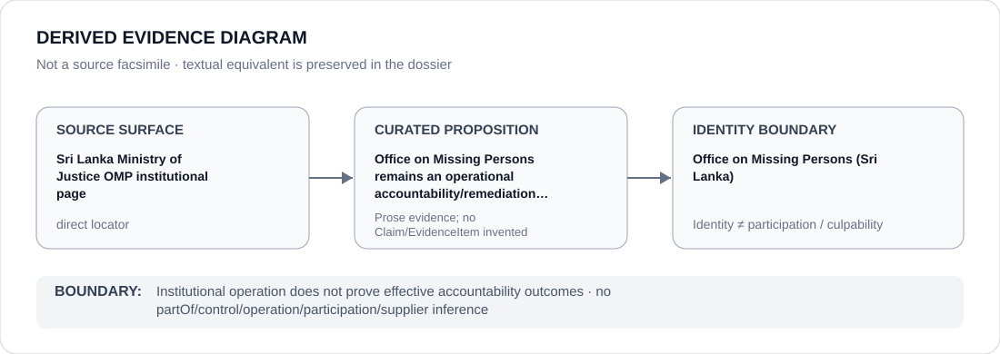

# Office on Missing Persons (Sri Lanka)

> **Canonical per-entity evidence/provenance record.** This dossier has no licensing effect by itself and carries no standalone `provisional_outcome`.

## Identity scope

Sri Lanka's Office on Missing Persons (OMP), represented as the accountability/remediation institution explicitly retained in the Sri Lanka State dossier and excluded from the current scoped restriction.

## State governance context

The canonical `LKA` State dossier records **S — Restricted with defined scope** for actual coercive PTA/counterterrorism use, detention/torture projects and specifically evidenced security/intelligence harassment. OMP, HRCSL/NPM, courts and independent reform/remedial work are excluded. The red `S` is **State context only** and is not inherited by OMP.

## Evidence record

- The Sri Lanka State dossier records that the Office on Missing Persons remains operational while broader justice/institutional reforms are pursued.
- The canonical source list preserves a direct Sri Lanka Ministry of Justice institutional locator for OMP.
- OMP's continued operation is treated as counter-evidence that materially narrows attribution, not as proof that disappearance/accountability concerns have been effectively resolved.
- The current Schedule boundary explicitly excludes OMP from the frozen CTID/PTA subset.

## Attribution and exclusions

Institutional operation does not establish successful tracing, accountability, remedy, independence or implementation of recommendations in any particular disappearance case. PTA detention, torture, surveillance/intimidation and security conduct are not attributed to OMP.

## Visual evidence

The diagram links the direct Ministry of Justice OMP institutional surface to the limited proposition that OMP remains operational, then stops at the identity boundary.

## Evidence gaps

This dossier does not establish OMP caseload outcomes, remedy rates, enforcement powers in practice or effectiveness for the war-affected communities referenced by the broader State review.

## Sources

- [Sri Lanka Ministry of Justice — Office on Missing Persons](https://moj.gov.lk/index.php/en/departments-institutes/institutions/office-on-missing-persons)
- [Canonical Sri Lanka State dossier](../states/LKA.md)

## Governance boundary

Operational status and exclusion from a Restricted Project do not create a favorable ECL designation for OMP. State `S` is context only; institutional identity does not imply control, participation, culpability or completed accountability.
