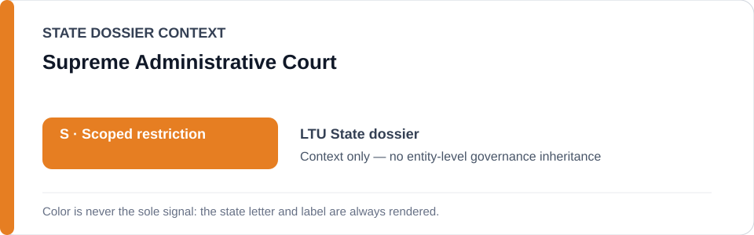
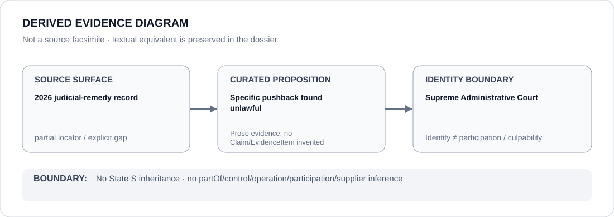

# Supreme Administrative Court

> **Canonical per-entity evidence/provenance record.** This dossier has no licensing effect by itself and carries no standalone `provisional_outcome`.

## Identity scope

Lithuania's Supreme Administrative Court, represented as the judicial counter-institution credited in the canonical State dossier.

## State governance context

The canonical `LTU` State dossier currently records **S — Scoped restriction**. That status is shown below as **context only** and is not inherited by the Supreme Administrative Court.

## Evidence record

- The Lithuania dossier records that in 2026 the Supreme Administrative Court found a specific pushback unlawful.
- That judicial remedy is counter-evidence supporting scoped rather than whole-State attribution.
- Courts and unrelated administration are expressly excluded from the active border/migration scope.

## Attribution and exclusions

The existence of one judicial remedy does not establish universal compliance, systemic cessation of pushbacks or generic court effectiveness. Conversely, the Court is not attributed the border-enforcement conduct it reviews.

## Visual evidence

The source surface is marked partial because the canonical dossier preserves an Amnesty country-report locator rather than a proposition-specific judgment URL.

## Evidence gaps

A direct locator for the specific 2026 Supreme Administrative Court pushback judgment is not preserved in the current canonical State dossier. That gap remains explicit.

## Sources

- [Amnesty International — Lithuania country report](https://www.amnesty.org/en/location/europe-and-central-asia/western-central-and-south-eastern-europe/lithuania/report-lithuania/)
- [Canonical State dossier provenance](../states/LTU.md)

## Governance boundary

Identity, judicial review or citation does not create border-guard participation, control, culpability or Material Participation. The orange `S` is State context only.
