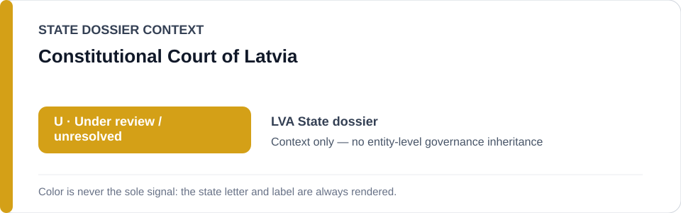
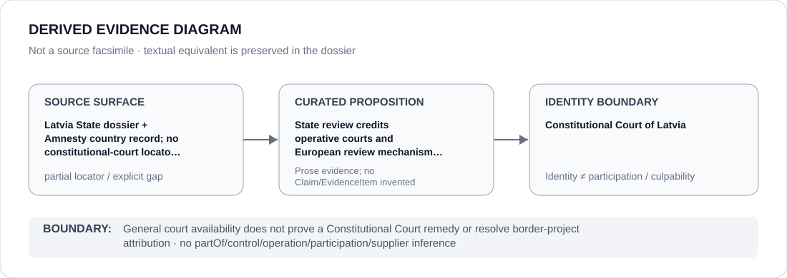

# Constitutional Court of Latvia

> **Canonical per-entity evidence/provenance record.** This dossier has no licensing effect by itself and carries no standalone `provisional_outcome`.

## Identity scope

Constitutional Court of Latvia, represented as the institution named in the canonical `LVA` State dossier for the repository-retained proposition below. Identity, mandate, adjudication, oversight, review, implementation or remediation activity does not itself create an ECL governance classification.

## State governance context

The canonical `LVA` State dossier records **U — Under Review**. That State-level status is context only and is not inherited by Constitutional Court of Latvia.

## Evidence record

- **Source surface:** Latvia State dossier + Amnesty country record; no constitutional-court locator retained.
- **Curated proposition:** State review credits operative courts and European review mechanisms while current pushback attribution remains unresolved.
- The proposition is preserved only at the granularity supported by the repository. It is not promoted into a new structured `Claim`, `EvidenceItem`, relation edge or Material Participation finding.
- State-dossier attribution remains separate from institution identity; evidence produced by, concerning or adjacent to an institution does not establish operation, control, culpability, supply, command or participation in conduct described elsewhere.

## Attribution and exclusions

General court availability does not prove a Constitutional Court remedy or resolve border-project attribution. State `U`, institutional class membership and dossier/source adjacency do not propagate into a generic finding about Constitutional Court of Latvia.

## Visual evidence

The diagram encodes the retained source granularity as **partial** and terminates at the institution identity boundary.

## Evidence gaps

The repository preserves the institutional proposition but not a one-to-one exact locator or document mapping at the same granularity. That source-precision gap remains explicit; no external reconstruction or inferred citation is inserted.

## Sources

- [Canonical LVA State dossier](../states/LVA.md)
- https://www.amnesty.org/en/location/europe-and-central-asia/western-central-and-south-eastern-europe/latvia/report-latvia/

## Governance boundary

This migration records identity and provenance only. It changes no State outcome, scope, Schedule entry, actor relationship, licensing effect or entity-level governance status.
