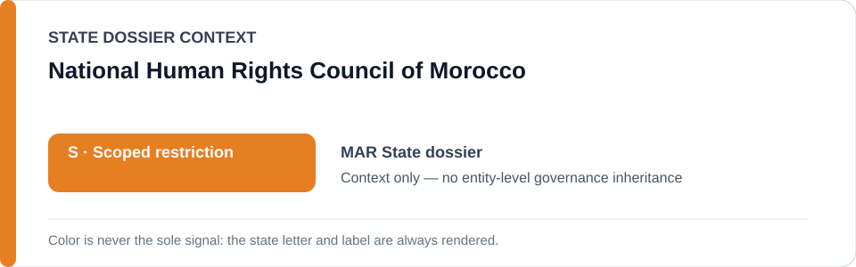
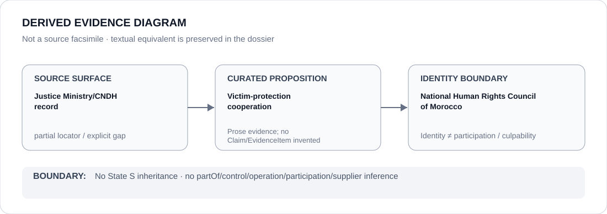

# National Human Rights Council of Morocco

> **Canonical per-entity evidence/provenance record.** This dossier has no licensing effect by itself and carries no standalone `provisional_outcome`.

## Identity scope

Morocco's National Human Rights Council (CNDH), represented as the institution named in victim-protection cooperation and reform counter-evidence.

## State governance context

The canonical `MAR` State dossier currently records **S — Scoped restriction**. That color/status is shown below as **context only**. It is not inherited by National Human Rights Council of Morocco.

## Evidence record

- The Morocco State dossier credits expanded Justice Ministry/National Human Rights Council victim-protection cooperation as meaningful counter-evidence.
- The same dossier explicitly concludes that general reform had not specifically remedied the Western Sahara/dissent conduct underlying the scoped State determination.

## Attribution and exclusions

This dossier does not establish generic CNDH effectiveness, participation in coercive conduct, or any standalone R/S/U/N outcome. Counter-evidence is not a governance downgrade by implication.

## Visual evidence

The diagram above is a **derived evidence diagram**, not a source facsimile. Its textual equivalent is the Evidence record, Sources and Evidence gaps sections of this dossier.

## Evidence gaps

The canonical State dossier preserves the Justice Ministry locator as reform/counter-evidence provenance, but does not provide a finer proposition-to-document mapping for every CNDH proposition.

## Sources

- [Morocco Ministry of Justice — retained reform/counter-evidence locator](https://justice.gov.ma/2026/03/19/15475/)
- [Canonical State dossier provenance](../states/MAR.md)

## Governance boundary

Identity, citation, counter-evidence or visual adjacency does not create `partOf`, `controls`, `operates`, `participatesIn`, `deploys`, supplier, command, membership, culpability or Material Participation relations. Any such relation requires separate structured curation.

The state-context color is a rendering aid only. `R`, `S`, `U` or `N` shown for the State dossier is not an actor score and must never be read as an entity-level designation.
