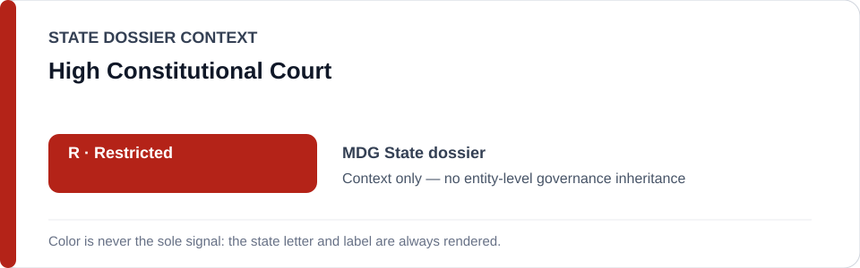
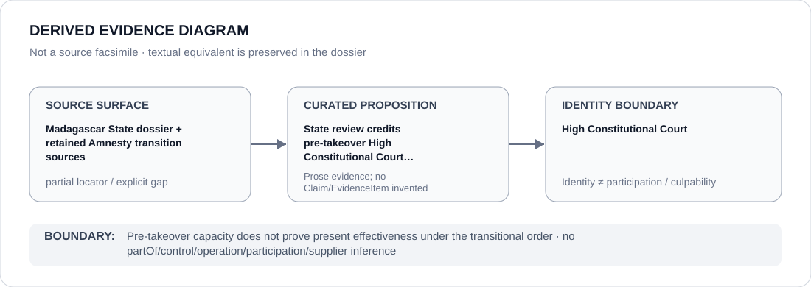

# High Constitutional Court

> **Canonical per-entity evidence/provenance record.** This dossier has no licensing effect by itself and carries no standalone `provisional_outcome`.

## Identity scope

This dossier represents **High Constitutional Court** as the institution identified in the canonical `MDG` review record. Identity is kept separate from any case, project, authority, member, subordinate body or participant unless the repository supplies a separate attributable relation or Claim.

## State governance context

The canonical `MDG` State dossier records **R — Restricted**. That State status is context only. It is not inherited by High Constitutional Court, and neither institutional class membership nor adjacency to the State dossier creates an entity-level governance outcome.

## Evidence record

- **Source granularity:** `partial`. The repository retains the institutional proposition, but not a one-to-one exact locator/document mapping at the same granularity. That precision gap is preserved rather than reconstructed.
- **Curated proposition:** State review credits pre-takeover High Constitutional Court remedial capacity as counter-evidence.
- The source surface is used only for that proposition and its provenance boundary. It is not promoted into evidence for unrelated conduct, generic institutional effectiveness, control, participation or culpability.
- Where the institution appears in a restrictive State context, that context remains a property of the State review or exact frozen project, not of the institution as a whole.

## Attribution and exclusions

Pre-takeover capacity does not prove present effectiveness under the transitional order. No `partOf`, control, operation, supply, command, membership, participation or Material Participation edge is inferred from this dossier. Producing evidence, adjudicating, reviewing, monitoring, administering, reforming or being named in a freeze does not by itself establish responsibility for the conduct documented elsewhere.

## Visual evidence

The diagram is derived from the manifest and terminates at the identity boundary. It is not a source facsimile and does not add a Claim or EvidenceItem.

## Evidence gaps

The current repository does not preserve a one-to-one exact locator/document mapping for the institution-level proposition at the same granularity. The dossier therefore remains explicitly `partial`; external reconstruction is not used to manufacture finer provenance.

## Sources

- [Canonical Madagascar State dossier](../states/MDG.md)
- https://www.amnesty.org/en/latest/news/2026/04/madagascar-immediately-end-repression-of-gen-z-activists-and-protect-right-to-protest/
- https://www.amnesty.org/en/latest/news/2026/03/from-gen-z-revolt-to-junta-control-madagascars-promise-of-change-is-slipping-away/
- [State R identity freeze](../../registry/schedule-state-r-freeze.yml)

## Governance boundary

Pre-takeover capacity does not prove present effectiveness under the transitional order. State `R` is contextual only, this dossier is non-operative, and any future institution-level applicability requires separately evidenced and capacity-specific attribution.
