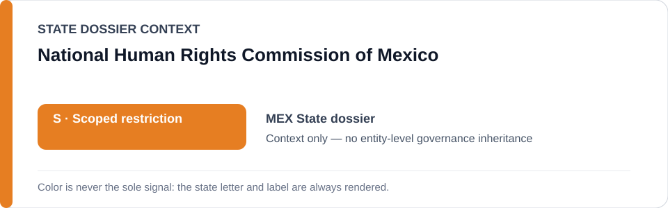
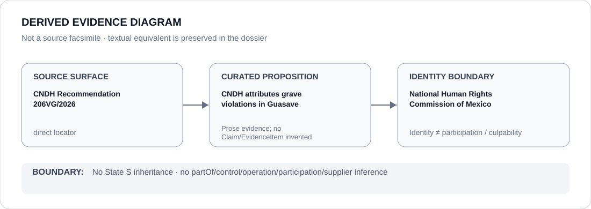

# National Human Rights Commission of Mexico

> **Canonical per-entity evidence/provenance record.** This dossier has no licensing effect by itself and carries no standalone `provisional_outcome`.

## Identity scope

Mexico's Comisión Nacional de los Derechos Humanos (CNDH), represented as the national human-rights institution referenced in the Mexico dossier. The aliases `CNDH` and `Comisión Nacional de los Derechos Humanos` resolve to this Mexico-scoped identity only.

## State governance context

The canonical `MEX` State dossier currently records **S — Scoped restriction** for specifically attributable security/disappearance/torture and coercive-data projects. That status is shown below as **context only** and is not inherited by CNDH.

## Evidence record

- The Mexico dossier records CNDH as a remedial/accountability institution and expressly excludes CNDH remedial functions from the active scoped restriction.
- CNDH Recommendation 206VG/2026 is retained as a direct official source: the State dossier summarizes it as attributing forced disappearance, torture and deprivation of life to Navy personnel in Guasave, Sinaloa.
- That recommendation is evidence provenance for a project-specific State assessment; it does not convert CNDH into a participant in the conduct it documents.

## Attribution and exclusions

Issuing a recommendation about alleged or established violations does not create control over, participation in or responsibility for the security actors addressed by the recommendation. This dossier creates no relation edge to SEMAR, no Material Participation finding and no standalone `S` status.

## Visual evidence

The diagram links the direct CNDH recommendation surface to the limited curated proposition that CNDH documented/attributed grave violations in the Guasave case, then stops at the CNDH identity boundary.

## Evidence gaps

This dossier does not encode the recommendation's individual factual findings as structured Claims/EvidenceItems, assess implementation of every CNDH recommendation, or infer the Commission's institutional effectiveness beyond the curated State-dossier record.

## Sources

- [CNDH Recommendation 206VG/2026](https://hist.cndh.org.mx/index.php/documento/recomendacion-206vg2026)
- [Canonical State dossier provenance](../states/MEX.md)

## Governance boundary

Human-rights documentation and remedial status do not create security participation, command, supplier status, culpability or Material Participation. The orange `S` is State context only.
