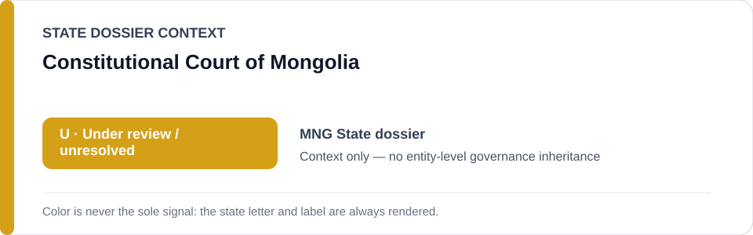
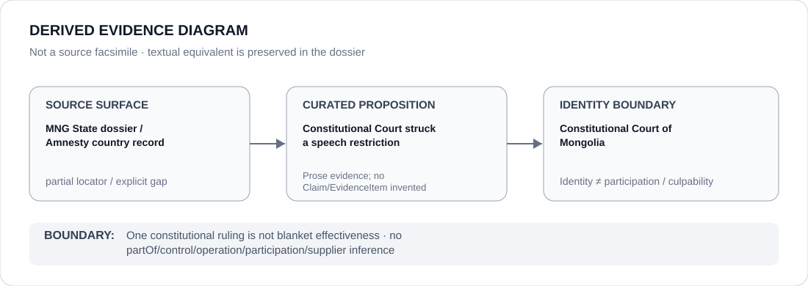

# Constitutional Court of Mongolia

> **Canonical per-entity evidence/provenance record.** This dossier has no licensing effect by itself and carries no standalone `provisional_outcome`.

## Identity scope

The Constitutional Court of Mongolia, represented as the constitutional counter-institution credited by the current Mongolia State dossier with striking a speech restriction.

## State governance context

The canonical `MNG` State dossier currently records **U — Under Review** for media/prosecution and coercive redevelopment/extractive concerns. Constitutional review is part of the counter-evidence against a stable coercive project. The amber `U` is **context only** and is not inherited by the Court.

## Evidence record

- The Mongolia State dossier explicitly states that the Constitutional Court struck a speech restriction.
- It treats that constitutional outcome and peaceful-protest political change as strong contrary evidence while retaining `U` because the reviewed coercive concerns are not yet resolved to `N`.
- The canonical corpus does not preserve the exact constitutional case, decision number, judgment date or a Court-specific locator for the speech ruling.

## Attribution and exclusions

A speech-protective ruling does not prove blanket Court independence, effectiveness or compliance across unrelated matters. Journalist pressure, redevelopment/mining consultation failures and coercive enforcement allegations are not attributed to the Court.

## Visual evidence

The diagram preserves the explicit State-dossier proposition while marking the external source surface as partial.

## Evidence gaps

The exact constitutional ruling, legal provision struck, docket, date, reasoning and implementation record are not retained in the current repository provenance. This dossier does not invent those details.

## Sources

- [Amnesty International — Mongolia country record](https://www.amnesty.org/en/location/asia-and-the-pacific/east-asia/mongolia/report-mongolia/)
- [Canonical Mongolia State dossier](../states/MNG.md)

## Governance boundary

A single rights-protective constitutional outcome does not create a favorable governance designation for the Court. State `U` is context only; institutional identity does not imply participation in the reviewed media, prosecution, redevelopment or extractive projects.
