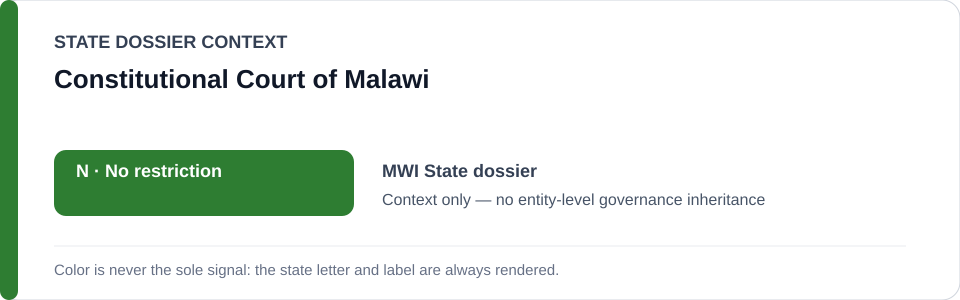
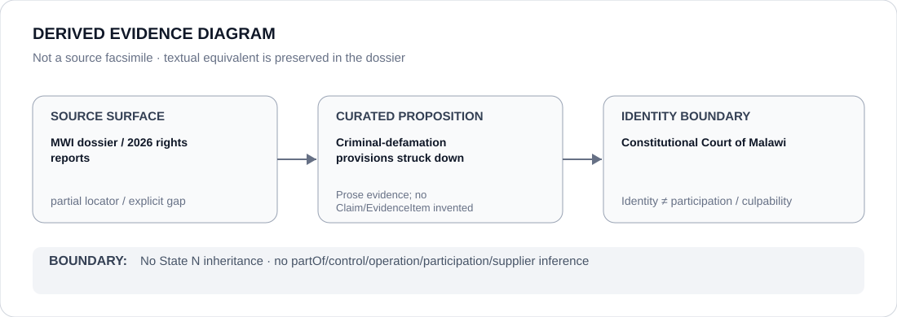

# Constitutional Court of Malawi

> **Canonical per-entity evidence/provenance record.** This dossier has no licensing effect by itself and carries no standalone `provisional_outcome`.

## Identity scope

Malawi's Constitutional Court, represented as the constitutional counter-institution credited in the canonical State dossier for a rights-protective 2026 ruling.

## State governance context

The canonical `MWI` State dossier currently records **N — No current state-level basis**. That status is shown below as **context only** and is not inherited by the Constitutional Court.

## Evidence record

- The Malawi State dossier records that in 2026 the Constitutional Court struck criminal-defamation provisions.
- It treats that development, together with torture convictions and other rights-protective rulings, as counter-evidence against a stable current coercive project.
- The State-level `N` result is not a standalone Court outcome and does not generalize the 2026 ruling into a complete effectiveness finding.

## Attribution and exclusions

Invalidating criminal-defamation provisions does not establish the Court's performance across all rights domains or prove compliance by all public institutions. This dossier does not attribute police abuse, discriminatory enforcement or civic-space restrictions to the Court.

## Visual evidence

The diagram is a derived representation of the rights-protective ruling provenance, not a source facsimile.

## Evidence gaps

The canonical State dossier cites country-level rights reports rather than an exact Constitutional Court judgment locator. The case name, docket and complete reasoning are therefore not reconstructed here and remain explicit provenance gaps.

## Sources

- [Amnesty International — Malawi 2026 country report](https://www.amnesty.org/en/location/africa/southern-africa/malawi/report-malawi/)
- [Human Rights Watch — World Report 2026: Malawi](https://www.hrw.org/world-report/2026/country-chapters/malawi)
- [Canonical State dossier provenance](../states/MWI.md)

## Governance boundary

Identity, a rights-protective ruling, citation or visual adjacency do not create operation, participation, culpability or Material Participation relations. Any actor-level governance finding requires separate structured evidence and adjudication.

The green `N` State-context color is a rendering aid only, not an institution-level designation.
