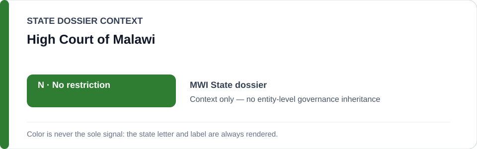
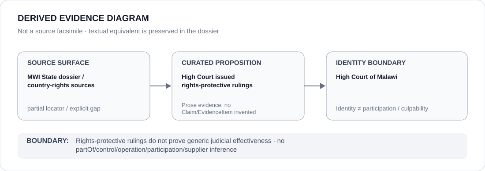

# High Court of Malawi

> **Canonical per-entity evidence/provenance record.** This dossier has no licensing effect by itself and carries no standalone `provisional_outcome`.

## Identity scope

The High Court of Malawi, represented only as the Malawian court credited in the current State dossier with rights-protective rulings. This record does not generalize from that proposition to the judiciary as a whole.

## State governance context

The canonical `MWI` State dossier currently records **N — No current state-level basis** after police accountability and rights-protective judicial outcomes outweighed the evidence for a current material/systematic ECL project. The green `N` is **State context only** and is not inherited by the High Court.

## Evidence record

- The Malawi State dossier explicitly records that the High Court has issued rights-protective rulings.
- That proposition appears alongside police torture convictions and a 2026 Constitutional Court decision striking criminal-defamation provisions as counter-evidence against a current coercive-project finding.
- The State dossier does not preserve the exact High Court case names, dockets, dates or judgment locators supporting its broader rights-protective-rulings statement.

## Attribution and exclusions

The presence of rights-protective rulings does not prove generic judicial effectiveness, universal compliance or remediation of every police/civic-space concern. Police abuse, discriminatory enforcement and other reviewed conduct are not attributed to the High Court.

## Visual evidence

The diagram marks the source surface as partial because the repository retains country-level rights sources rather than a proposition-specific High Court judgment locator.

## Evidence gaps

Exact High Court cases, operative holdings, dates, compliance outcomes and a direct court locator are not preserved in the current canonical corpus. Those gaps remain explicit and are not reconstructed from outside knowledge.

## Sources

- [Amnesty International — Malawi country record](https://www.amnesty.org/en/location/africa/southern-africa/malawi/report-malawi/)
- [Human Rights Watch — Malawi World Report 2026](https://www.hrw.org/world-report/2026/country-chapters/malawi)
- [Canonical Malawi State dossier](../states/MWI.md)

## Governance boundary

Rights-protective adjudication is evidence of a remedial channel, not a standalone ECL outcome for the Court. State `N`, dossier adjacency and visual adjacency do not imply governance, control, participation or culpability.
