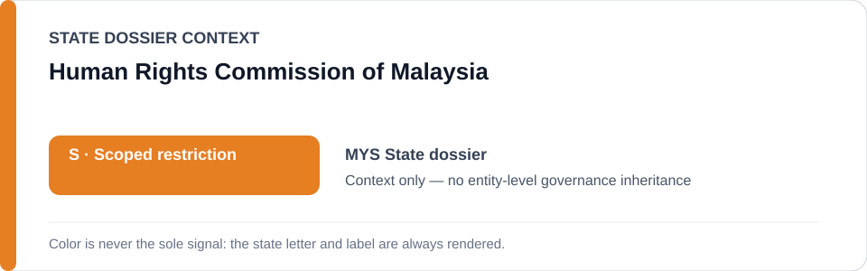
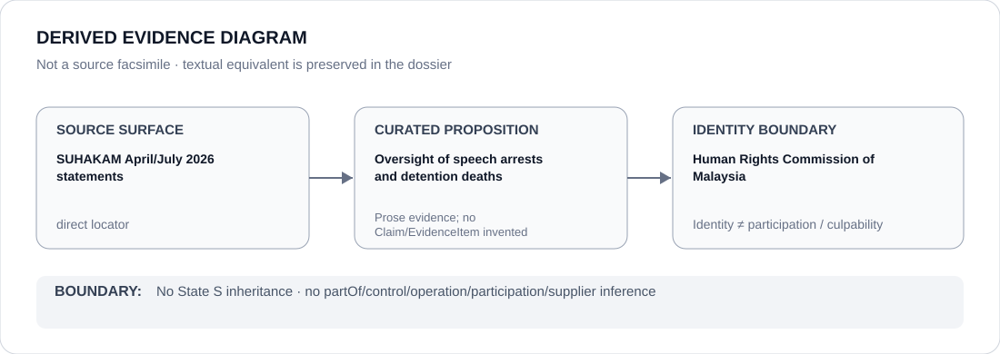

# Human Rights Commission of Malaysia

> **Canonical per-entity evidence/provenance record.** This dossier has no licensing effect by itself and carries no standalone `provisional_outcome`.

## Identity scope

Malaysia's Human Rights Commission (SUHAKAM), represented as the national human-rights counter-institution referenced in the Malaysia dossier. `SUHAKAM` resolves to this Malaysia-scoped identity.

## State governance context

The canonical `MYS` State dossier currently records **S — Scoped restriction** for specific speech/public-order enforcement and immigration-detention projects. That status is shown below as **context only** and is not inherited by SUHAKAM.

## Evidence record

- In April 2026 SUHAKAM criticized arrest/detention following a peaceful placard display and separately called for restraint and legal review after custodial remand for non-violent online criticism.
- In July 2026 SUHAKAM reported the Home Affairs Ministry's parliamentary disclosure of 465 deaths in immigration detention depots from 2021–2025 and called for systemic reform, transparency and independent accountability.
- The Malaysia dossier treats SUHAKAM as active counter-evidence and expressly excludes SUHAKAM from the current scoped restriction.

## Attribution and exclusions

SUHAKAM's monitoring and public statements do not attribute police, speech-law enforcement, the Home Affairs Ministry or immigration-detention operations to SUHAKAM. Nor does this dossier infer that SUHAKAM oversight is always effective. It assigns no standalone `S` status.

## Visual evidence

The diagram uses the directly linked April/July 2026 SUHAKAM statements as source surfaces and preserves the distinction between oversight/documentation and the coercive projects being reviewed.

## Evidence gaps

This dossier does not create structured Claims for every incident described in the SUHAKAM statements, quantify remedial effectiveness, or infer responsibility for the underlying arrests or detention conditions.

## Sources

- [SUHAKAM media statement no. 17/2026](https://suhakam.org.my/2026/04/media-statement-no-17-2026_suhakam-raises-concern-over-arrests-calls-for-rights-based-approach-to-freedom-of-expression/)
- [SUHAKAM media statement no. 19/2026](https://suhakam.org.my/2026/04/media-statement-no-19-2026_suhakam-calls-for-restraint-and-review-of-laws-following-arrest-of-social-media-user/)
- [SUHAKAM media statement no. 38/2026](https://suhakam.org.my/2026/07/media-statement-no-38-2026_suhakam-calls-for-urgent-reforms-to-immigration-detention-centres/)
- [Canonical State dossier provenance](../states/MYS.md)

## Governance boundary

Oversight, criticism and remediation advocacy do not create police/detention participation, executive control, culpability or Material Participation. The orange `S` is State context only.
