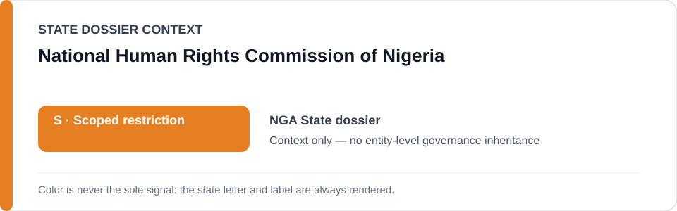
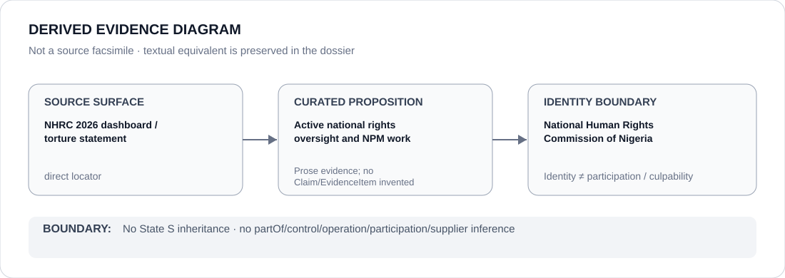

# National Human Rights Commission of Nigeria

> **Canonical per-entity evidence/provenance record.** This dossier has no licensing effect by itself and carries no standalone `provisional_outcome`.

## Identity scope

Nigeria's National Human Rights Commission (NHRC), represented as the national quasi-judicial human-rights counter-institution referenced in the Nigeria dossier. The aliases `Nigeria's National Human Rights Commission` and `NHRC Nigeria` remain Nigeria-scoped.

## State governance context

The canonical `NGA` State dossier currently records **S — Scoped restriction** for specifically evidenced coercive security units/projects. That status is shown below as **context only** and is not inherited by NHRC.

## Evidence record

- The Nigeria dossier records NHRC as an active quasi-judicial counter-institution and expressly excludes NHRC, courts and independent oversight/remedial functions from the scoped restriction.
- In 2026 the State dossier records NHRC human-rights dashboards and continuing torture-prevention/detention-oversight work in its National Preventive Mechanism role.
- The preserved official NHRC sources include the April 2026 human-rights dashboard and a June 2026 statement reaffirming torture-prevention, victim-protection and accountability work.

## Attribution and exclusions

NHRC documentation, advisory or preventive-monitoring activity does not attribute Tiger Base, police, military or other public-security operations to NHRC. Positive oversight evidence also does not establish blanket effectiveness. This dossier creates no standalone `S` status or Material Participation finding.

## Visual evidence

The diagram uses direct NHRC source surfaces to preserve the limited proposition that an active national oversight/NPM function exists while keeping security-project attribution outside the NHRC identity boundary.

## Evidence gaps

This dossier does not assess the effectiveness of every NHRC intervention, encode all dashboard observations as structured Claims/EvidenceItems, or infer outcomes for particular detention facilities beyond the canonical State dossier.

## Sources

- [NHRC — April 2026 Human Rights Dashboard](https://www.nigeriarights.gov.ng/nhrc-media/data-and-infographics/644-april-2026-human-rights-dashboard.html)
- [NHRC — International Day in Support of Victims of Torture statement](https://www.nigeriarights.gov.ng/nhrc-media/news-and-events/654-international-day-in-support-of-victims-of-torture-nhrc-reaffirms-commitment-to-preventing-torture-protecting-dignity-and-securing-justice-for-victims.html)
- [Canonical State dossier provenance](../states/NGA.md)

## Governance boundary

Human-rights monitoring, preventive functions and accountability advocacy do not create police/security participation, command, culpability or Material Participation. The orange `S` is State context only.
