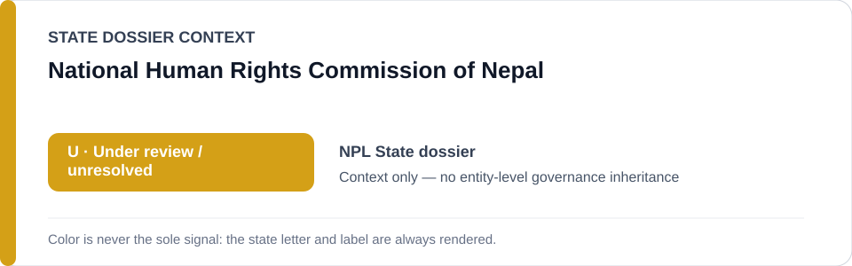
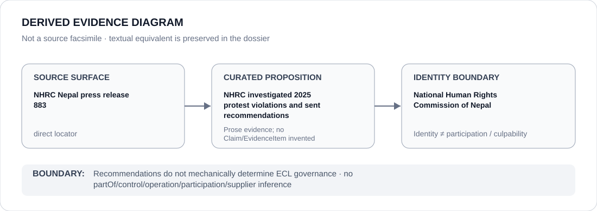

# National Human Rights Commission of Nepal

> **Canonical per-entity evidence/provenance record.** This dossier has no licensing effect by itself and carries no standalone `provisional_outcome`.

## Identity scope

Nepal's National Human Rights Commission (NHRC), represented as the human-rights accountability institution whose investigation and recommendations concerning the September 2025 `Gen Z` protest violations are preserved in the current Nepal State dossier.

## State governance context

The canonical `NPL` State dossier currently records **U — Under Review**, after a prior `S` was downgraded because government change and active NHRC accountability broke the evidentiary continuity needed to preserve a current restriction by inertia. That `U` is **context only** and is not inherited by the NHRC.

## Evidence record

- The Nepal State dossier records that the NHRC completed its investigation into human-rights violations during the September 2025 youth protests.
- It records that the Commission transmitted recommendations to the Government in May 2026.
- The canonical dossier preserves an exact NHRC press-release locator for that accountability activity.
- The State review treats this activity as material counter-evidence when testing continuity of the prior protest-repression project.

## Attribution and exclusions

The NHRC's investigation and recommendations do not mechanically determine whether government actors complied, whether remediation was complete or what ECL outcome should follow. Past protest conduct is not attributed to the NHRC, and no control, command, participation or Material Participation relation is created.

## Visual evidence

The diagram links the exact NHRC source to the limited proposition that the Commission investigated the protest violations and transmitted recommendations, then stops at the institution-identity boundary.

## Evidence gaps

This dossier does not establish implementation of every NHRC recommendation, the full outcome of accountability proceedings, or the Commission's effectiveness across unrelated matters. Those propositions require separate evidence and review.

## Sources

- [NHRC Nepal — press release 883](https://www.nhrcnepal.org/press_release/detail/883)
- [Canonical Nepal State dossier](../states/NPL.md)

## Governance boundary

Investigation, recommendations and counter-evidence status do not create a standalone governance outcome for the NHRC. The amber `U` is State context only; institutional identity does not imply participation in the underlying protest-policing project.
