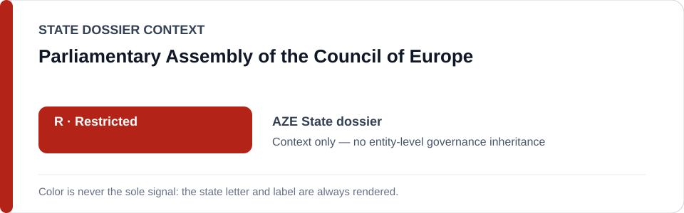
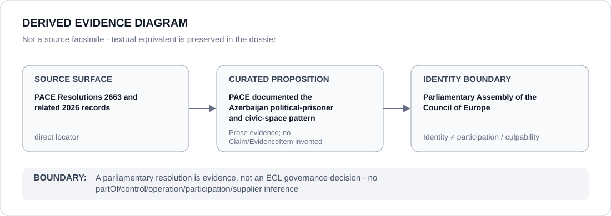

# Parliamentary Assembly of the Council of Europe

> **Canonical per-entity evidence/provenance record.** This dossier has no licensing effect by itself and carries no standalone `provisional_outcome`.

## Identity scope

The Parliamentary Assembly of the Council of Europe (PACE), represented as the regional parliamentary body whose 2026 records form part of the evidence provenance for the Azerbaijan State dossier. PACE resolutions remain evidentiary/legal-political source material, not ECL governance decisions.

## State governance context

The canonical `AZE` State dossier records **R — State apparatus Restricted**. PACE is an external evidence-producing institution, not part of the Azerbaijani State apparatus. The red `R` shown below is **Azerbaijan State context only** and is not inherited by PACE.

## Evidence record

- PACE Resolution 2663 of 24 June 2026 is cited by the Azerbaijan dossier for a systemic pattern of silencing critical voices, the reported political-prisoner count, renewed prosecution of Anar Mammadli and non-implementation of leading ECtHR judgments.
- A second direct PACE locator is retained in the same State dossier as part of the current/historical evidentiary baseline.
- The State review uses those records as source evidence when assessing Azerbaijan; it does not assign PACE an ECL tier or make PACE responsible for the conduct it documents.

## Attribution and exclusions

A parliamentary resolution can support a factual/legal proposition without becoming an ECL GovernanceDecision. Membership, regional association or source citation does not create control, sponsorship, participation or Material Participation relations between PACE and the State or projects under review.

## Visual evidence

The diagram links the direct PACE source surface to the limited proposition that PACE documented the reviewed pattern, then terminates at the institution identity boundary.

## Evidence gaps

This dossier does not independently re-adjudicate every factual statement in the cited PACE records, assess implementation after the State cutoff or infer any relationship between PACE and Azerbaijan beyond evidence provenance.

## Sources

- [PACE — 2026 record 36229](https://pace.coe.int/en/files/36229/html)
- [PACE — 2026 record 35803](https://pace.coe.int/en/files/35803/html)
- [Canonical Azerbaijan State dossier](../states/AZE.md)

## Governance boundary

PACE source material may inform a State review, but PACE identity, a resolution or regional institutional status cannot mechanically create or inherit an ECL outcome. Azerbaijan `R` is context only.
