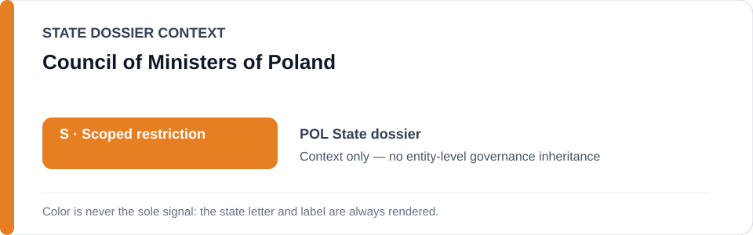
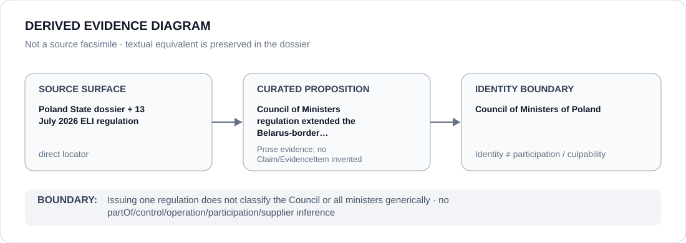

# Council of Ministers of Poland

> **Canonical per-entity evidence/provenance record.** This dossier has no licensing effect by itself and carries no standalone `provisional_outcome`.

## Identity scope

This dossier represents **Council of Ministers of Poland** as the institution identified in the canonical `POL` review record. Identity is kept separate from any case, project, authority, member, subordinate body or participant unless the repository supplies a separate attributable relation or Claim.

## State governance context

The canonical `POL` State dossier records **S — Scoped restriction**. That State status is context only. It is not inherited by Council of Ministers of Poland, and neither institutional class membership nor adjacency to the State dossier creates an entity-level governance outcome.

## Evidence record

- **Source granularity:** `direct`. The repository retains an exact source surface adequate for the curated proposition below.
- **Curated proposition:** Council of Ministers regulation extended the Belarus-border international-protection restriction in July 2026.
- The source surface is used only for that proposition and its provenance boundary. It is not promoted into evidence for unrelated conduct, generic institutional effectiveness, control, participation or culpability.
- Where the institution appears in a restrictive State context, that context remains a property of the State review or exact frozen project, not of the institution as a whole.

## Attribution and exclusions

Issuing one regulation does not classify the Council or all ministers generically. No `partOf`, control, operation, supply, command, membership, participation or Material Participation edge is inferred from this dossier. Producing evidence, adjudicating, reviewing, monitoring, administering, reforming or being named in a freeze does not by itself establish responsibility for the conduct documented elsewhere.

## Visual evidence

The diagram is derived from the manifest and terminates at the identity boundary. It is not a source facsimile and does not add a Claim or EvidenceItem.

## Evidence gaps

No source-precision gap is asserted for the curated proposition at the repository level. This does **not** mean the record proves every broader proposition about Council of Ministers of Poland; only the proposition stated above is treated as locator-complete.

## Sources

- [Canonical Poland State dossier](../states/POL.md)
- https://eli.gov.pl/eli/DU/2026/945/ogl
- https://eli.gov.pl/eli/MP/2026/674/ogl
- [Promoted Poland border freeze](../../registry/schedule-state-s-freezes/promoted-ready-02.yml)

## Governance boundary

Issuing one regulation does not classify the Council or all ministers generically. State `S` is contextual only, this dossier is non-operative, and any future institution-level applicability requires separately evidenced and capacity-specific attribution.
