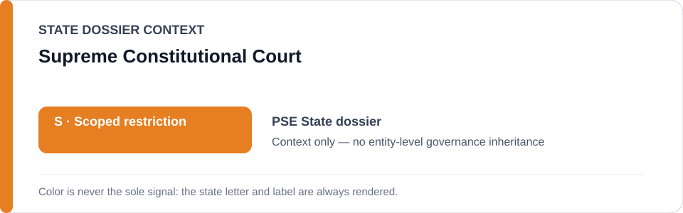
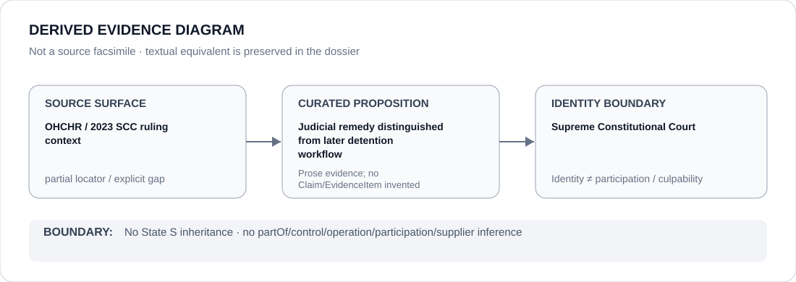

# Supreme Constitutional Court

> **Canonical per-entity evidence/provenance record.** This dossier has no licensing effect by itself and carries no standalone `provisional_outcome`.

## Identity scope

The Palestinian Supreme Constitutional Court, represented only to preserve the judicial/remedial boundary referenced by the canonical Palestine dossier and Schedule freeze provenance.

## State governance context

The canonical `PSE` State dossier currently records **S — Scoped restriction**. That status is shown below as **context only** and is not inherited by the Supreme Constitutional Court.

## Evidence record

- The Palestine State dossier treats courts issuing release orders as meaningful counter-institutions even when security bodies fail to comply.
- Its Schedule boundary separately identifies a post-ruling detention workflow connected to a January 2023 Supreme Constitutional Court ruling and July 2026 OHCHR reporting.
- The Court/ruling is therefore kept distinct from subsequent detention or non-compliance conduct.

## Attribution and exclusions

A court ruling is not evidence that the Court operated the later detention workflow. This dossier does not infer enforcement control, security participation, torture/detention responsibility or a standalone `S` outcome.

## Visual evidence

The source surface is marked partial because the canonical dossier preserves current OHCHR/UN locators and names the January 2023 ruling, but does not provide a direct ruling URL.

## Evidence gaps

The exact January 2023 Supreme Constitutional Court ruling locator is not preserved in the State dossier. The court-to-post-ruling-workflow distinction is preserved without filling that locator gap by inference.

## Sources

- [OHCHR/UNISPAL — July 2026 arbitrary detention, torture and ill-treatment record](https://www.un.org/unispal/document/ohchr-palestinian-authorities-must-stop-practices-arbitrary-detention-torture-and-ill-treatment-en-ar/)
- [Canonical State dossier provenance](../states/PSE.md)

## Governance boundary

Identity, rulings, release orders or visual adjacency do not create security participation, detention operation, control, culpability or Material Participation. The orange `S` is State context only.
