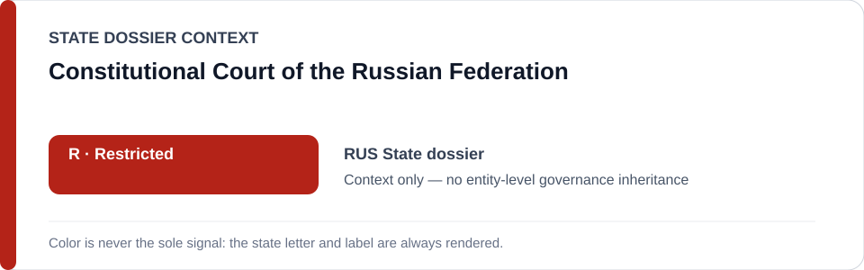
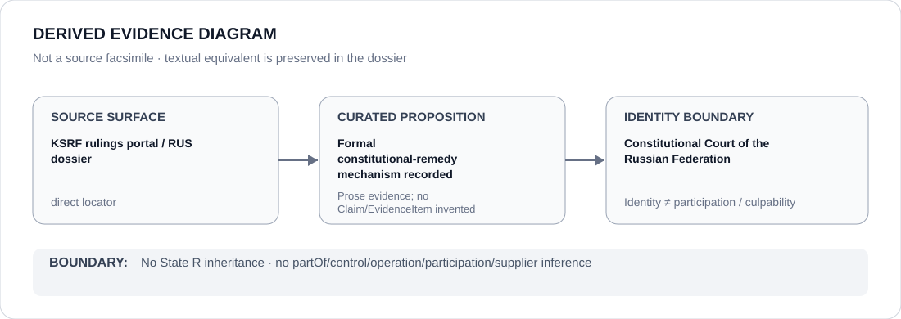

# Constitutional Court of the Russian Federation

> **Canonical per-entity evidence/provenance record.** This dossier has no licensing effect by itself and carries no standalone `provisional_outcome`.

## Identity scope

The Constitutional Court of the Russian Federation, represented as a formal constitutional-remedy institution separately from the broader Russian State apparatus and from any specific military, security, detention, occupation or administrative project.

## State governance context

The canonical `RUS` State dossier currently records **R — Restricted State apparatus**. That status is shown below as **context only**. It is not automatically inherited by this Court merely because the State-level freeze describes a broader judicial apparatus class.

## Evidence record

- The Russia State dossier records the continued existence of the Constitutional Court and formal legal-remedy structures as counter-evidence.
- It preserves the Court's rulings portal as an institutional/legal-remedy locator.
- The same State review expressly concludes that the formal mechanisms then reviewed did not establish sufficiently effective restraint of the domestic and occupation-related conduct underlying the State-level `R` determination.

## Attribution and exclusions

Formal constitutional-remedy capacity neither rebuts the State-level record by itself nor proves that this Court materially participates in every State project covered by the broader `R` scope. Class-level references to a judicial apparatus are not converted here into a standalone actor finding.

## Visual evidence

The diagram is a derived representation of the formal-remedy provenance and its explicit effectiveness gap, not a source facsimile.

## Evidence gaps

The current corpus does not contain a Court-specific Formal Exergism assessment, case-by-case effectiveness review or structured Material Participation finding for this institution. The rulings portal is an exact institutional locator, but the effectiveness of particular remedies requires proposition-specific evidence.

## Sources

- [Constitutional Court of the Russian Federation — rulings portal](https://www.ksrf.ru/en/Rulings/Rulings.php)
- [Canonical State dossier provenance](../states/RUS.md)

## Governance boundary

Identity, State-apparatus class membership, formal-remedy capacity, citation or visual adjacency do not create a standalone `R` outcome, Material Participation, command, control or operation relation. Those require separate structured curation and adjudication.

The red `R` State-context color is a rendering aid only, not an institution-level designation.
