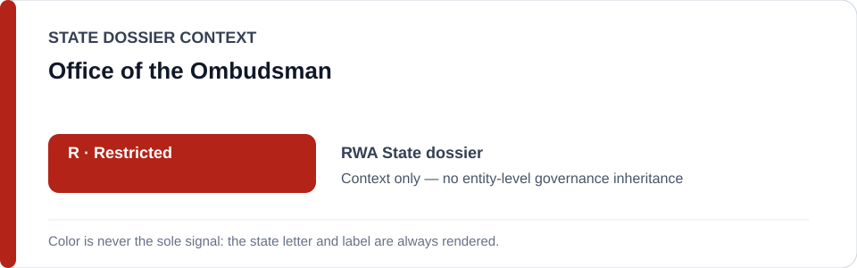
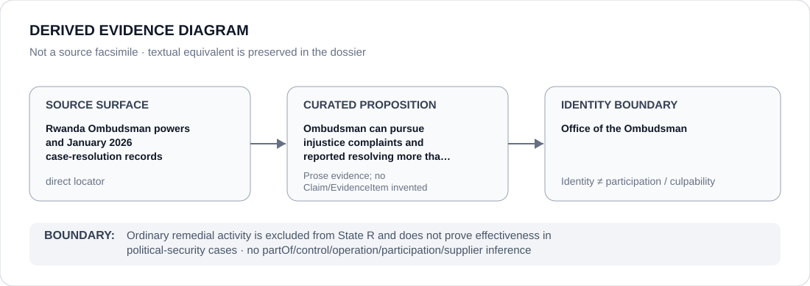

# Office of the Ombudsman

> **Canonical per-entity evidence/provenance record.** This dossier has no licensing effect by itself and carries no standalone `provisional_outcome`.

## Identity scope

Office of the Ombudsman, represented as the institution named in the canonical `RWA` State dossier for the repository-retained proposition below. Identity, mandate, adjudication, oversight, review, implementation or remediation activity does not itself create an ECL governance classification.

## State governance context

The canonical `RWA` State dossier records **R — Restricted**. That State-level status is context only and is not inherited by Office of the Ombudsman.

## Evidence record

- **Source surface:** Rwanda Ombudsman powers and January 2026 case-resolution records.
- **Curated proposition:** Ombudsman can pursue injustice complaints and reported resolving more than one hundred citizen cases in outreach.
- The proposition is preserved only at the granularity supported by the repository. It is not promoted into a new structured `Claim`, `EvidenceItem`, relation edge or Material Participation finding.
- State-dossier attribution remains separate from institution identity; evidence produced by, concerning or adjacent to an institution does not establish operation, control, culpability, supply, command or participation in conduct described elsewhere.

## Attribution and exclusions

Ordinary remedial activity is excluded from State R and does not prove effectiveness in political-security cases. State `R`, institutional class membership and dossier/source adjacency do not propagate into a generic finding about Office of the Ombudsman.

## Visual evidence

The diagram encodes the retained source granularity as **direct** and terminates at the institution identity boundary.

## Evidence gaps

The retained repository source surface is sufficiently exact for the curated proposition above. That exactness is proposition-specific and does not establish broader institutional effectiveness, participation or governance.

## Sources

- [Canonical RWA State dossier](../states/RWA.md)
- https://www.ombudsman.gov.rw/en/about-us/powers
- https://www.ombudsman.gov.rw/en/news/others/urwego-rwumuvunyi-rwakemuye-ibibazo-105-mu-minsi-4

## Governance boundary

This migration records identity and provenance only. It changes no State outcome, scope, Schedule entry, actor relationship, licensing effect or entity-level governance status.
