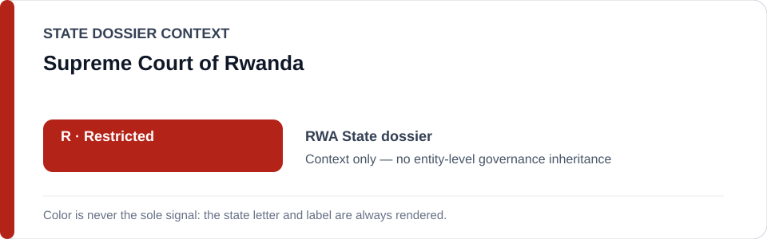
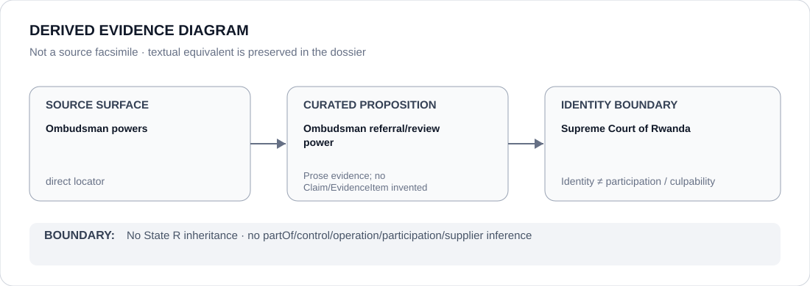

# Supreme Court of Rwanda

> **Canonical per-entity evidence/provenance record.** This dossier has no licensing effect by itself and carries no standalone `provisional_outcome`.

## Identity scope

The Supreme Court of Rwanda, represented only as the court named in the Rwandan Ombudsman/accountability carve-out.

## State governance context

The canonical `RWA` State dossier currently records **R — Restricted**. That color/status is shown below as **context only**. It is not inherited by Supreme Court of Rwanda.

## Evidence record

- The Rwanda State dossier records that the Office of the Ombudsman may ask the Supreme Court to review a final judgment marred by injustice.
- That same dossier treats genuinely independent Ombudsman/Supreme Court accountability activity as excluded remedial activity rather than as conduct inherited from the State-level R determination.

## Attribution and exclusions

This dossier does not establish judicial independence, effectiveness, a particular case outcome, participation in restricted conduct, or any standalone R/S/U/N outcome for the Supreme Court.

## Visual evidence

The diagram above is a **derived evidence diagram**, not a source facsimile. Its textual equivalent is the Evidence record, Sources and Evidence gaps sections of this dossier.

## Evidence gaps

No proposition-specific court decision is curated here; the present evidence establishes identity and the remedial/accountability role described by the canonical State dossier.

## Sources

- [Rwanda Office of the Ombudsman — powers](https://www.ombudsman.gov.rw/en/about-us/powers)
- [Canonical State dossier provenance](../states/RWA.md)

## Governance boundary

Identity, citation, counter-evidence or visual adjacency does not create `partOf`, `controls`, `operates`, `participatesIn`, `deploys`, supplier, command, membership, culpability or Material Participation relations. Any such relation requires separate structured curation.

The state-context color is a rendering aid only. `R`, `S`, `U` or `N` shown for the State dossier is not an actor score and must never be read as an entity-level designation.
