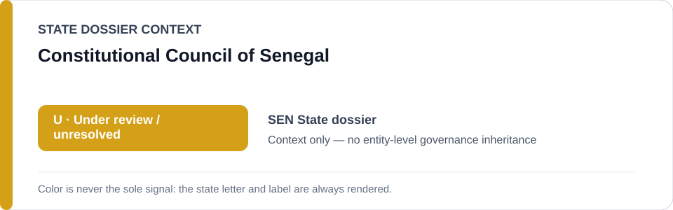
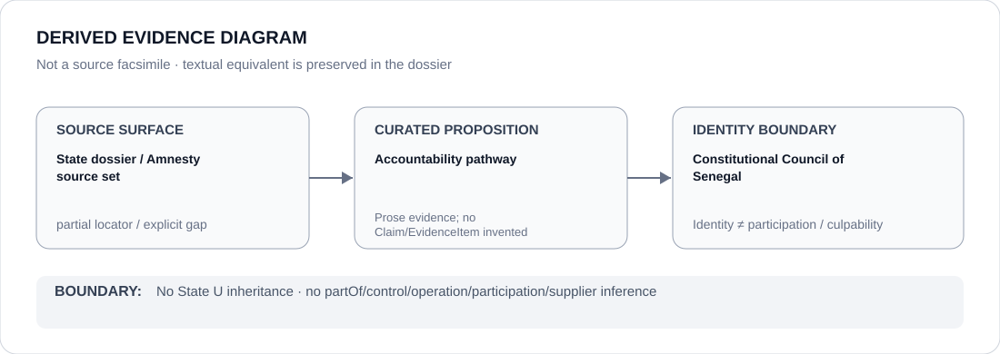

# Constitutional Council of Senegal

> **Canonical per-entity evidence/provenance record.** This dossier has no licensing effect by itself and carries no standalone `provisional_outcome`.

## Identity scope

The Constitutional Council of Senegal, represented as the constitutional body named in the State dossier's accountability/counter-evidence record.

## State governance context

The canonical `SEN` State dossier currently records **U — Under review / unresolved**. That color/status is shown below as **context only**. It is not inherited by Constitutional Council of Senegal.

## Evidence record

- The Senegal State dossier records that the Constitutional Council opened a path to prosecute 2021–2024 killings/torture as part of the counter-evidence preventing a stable restriction.
- The same dossier retains U because expression detentions and active remediation coexist.

## Attribution and exclusions

This dossier does not establish that the Council itself produced a complete remedy, does not attribute expression/public-order coercion to it, and does not assign a standalone U outcome.

## Visual evidence

The diagram above is a **derived evidence diagram**, not a source facsimile. Its textual equivalent is the Evidence record, Sources and Evidence gaps sections of this dossier.

## Evidence gaps

The current canonical State dossier does not preserve a proposition-specific Constitutional Council decision URL. That source-granularity gap remains explicit rather than being filled by inference.

## Sources

- [Amnesty International — Senegal country report](https://www.amnesty.org/en/location/africa/west-and-central-africa/senegal/report-senegal/)
- [Canonical State dossier provenance](../states/SEN.md)

## Governance boundary

Identity, citation, counter-evidence or visual adjacency does not create `partOf`, `controls`, `operates`, `participatesIn`, `deploys`, supplier, command, membership, culpability or Material Participation relations. Any such relation requires separate structured curation.

The state-context color is a rendering aid only. `R`, `S`, `U` or `N` shown for the State dossier is not an actor score and must never be read as an entity-level designation.
