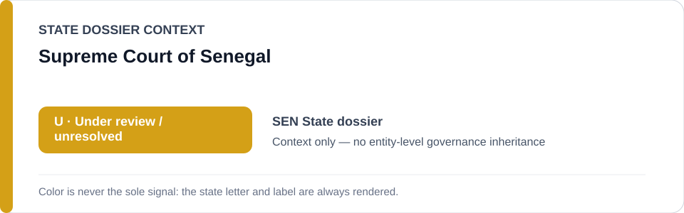
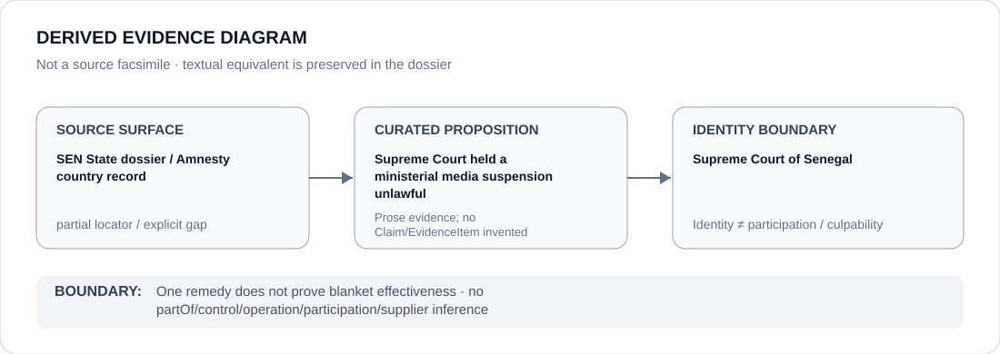

# Supreme Court of Senegal

> **Canonical per-entity evidence/provenance record.** This dossier has no licensing effect by itself and carries no standalone `provisional_outcome`.

## Identity scope

The Supreme Court of Senegal, represented as the court credited in the current Senegal State dossier with holding a ministerial media suspension unlawful. This record is limited to that repository-preserved remedial proposition.

## State governance context

The canonical `SEN` State dossier currently records **U — Under Review** because expression detentions coexist with active courts and accountability reforms. That `U` is **context only** and is not inherited by the Supreme Court.

## Evidence record

- The Senegal State dossier records that the Supreme Court held a ministerial media suspension unlawful.
- The same review treats that judicial action, a Constitutional Council accountability pathway and other accountability developments as counter-evidence against a stable `S`.
- The State dossier does not identify the exact Supreme Court docket, judgment date or full reasoning for the media-suspension ruling.

## Attribution and exclusions

One judicial remedy does not establish blanket institutional independence, effectiveness or durable compliance. The Court is not attributed the expression detentions, media suspensions, public-order enforcement or accountability failures under State review.

## Visual evidence

The diagram marks the source surface as partial: the proposition is explicit in the State dossier, but the retained external locator is the broader Amnesty Senegal record rather than an exact Court judgment.

## Evidence gaps

The exact judgment/docket locator, procedural posture, remedy mechanics and implementation record are not preserved in the current canonical corpus. This dossier leaves those gaps explicit rather than reconstructing them by inference.

## Sources

- [Amnesty International — Senegal country record](https://www.amnesty.org/en/location/africa/west-and-central-africa/senegal/report-senegal/)
- [Canonical Senegal State dossier](../states/SEN.md)

## Governance boundary

A favorable judicial ruling and counter-evidence status do not create a standalone ECL designation for the Court. The amber `U` is State context only and does not propagate governance, control, participation, command or culpability.
