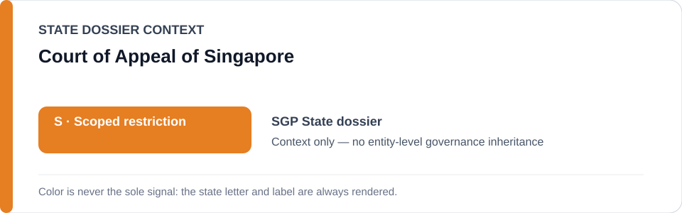
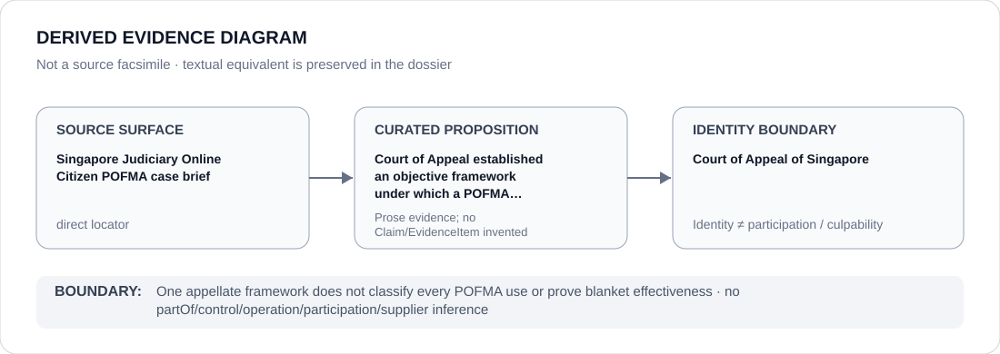

# Court of Appeal of Singapore

> **Canonical per-entity evidence/provenance record.** This dossier has no licensing effect by itself and carries no standalone `provisional_outcome`.

## Identity scope

Court of Appeal of Singapore, represented as the appellate court named in the `SGP` State dossier for the POFMA appellate framework preserved below. Appellate identity is not itself an ECL governance classification.

## State governance context

The canonical `SGP` State dossier records **S — Scoped restriction** for specified POFMA/information-control and public-order/assembly projects materially implementing unlawful political repression. State `S` is context only and is not inherited by Court of Appeal of Singapore.

## Evidence record

- The Singapore State dossier retains an official Singapore Judiciary case brief for *The Online Citizen Pte Ltd v Attorney-General and another appeal and other matters*.
- The dossier credits the Court of Appeal with establishing an objective framework under which a POFMA direction may be set aside.
- That proposition is counter-evidence relevant to contestability of POFMA enforcement; it is not expanded into a conclusion about every POFMA direction, every appeal or the court's performance across unrelated matters.

## Attribution and exclusions

The retained appellate proposition does not establish authorship, operation, control or implementation of the underlying ministerial directions and does not create a Material Participation, culpability or governance finding concerning Court of Appeal of Singapore.

## Visual evidence

The diagram treats the official Judiciary case brief as a direct evidence surface and terminates at the appellate-court identity boundary.

## Evidence gaps

One appellate framework does not establish blanket judicial independence, uniform effectiveness or rights-compliant POFMA implementation in every case.

## Sources

- [Canonical SGP State dossier](../states/SGP.md)
- [Singapore Judiciary — *The Online Citizen* POFMA case brief](https://www.judiciary.gov.sg/judgments/case-briefs-by-smu/the-online-citizen-pte-ltd-v-attorney-general-and-another-appeal-and-other-matters)

## Governance boundary

One appellate framework does not classify every POFMA use or prove blanket effectiveness. State `S` and case adjacency do not propagate to Court of Appeal of Singapore.
