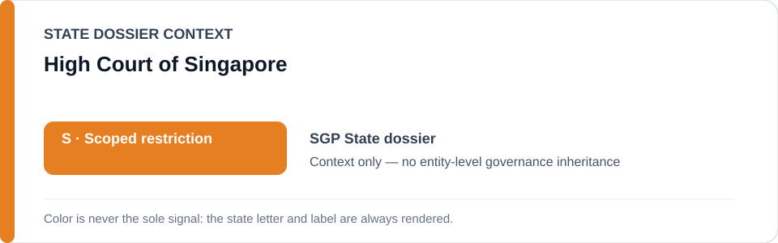
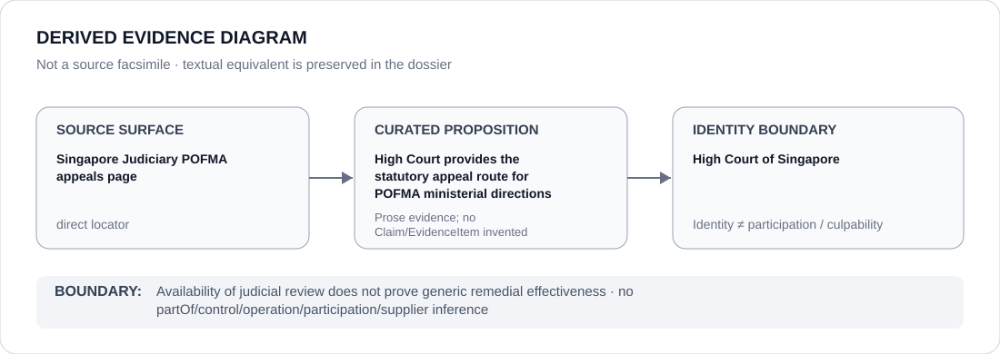

# High Court of Singapore

> **Canonical per-entity evidence/provenance record.** This dossier has no licensing effect by itself and carries no standalone `provisional_outcome`.

## Identity scope

High Court of Singapore, represented as the domestic court named in the `SGP` State dossier for the POFMA judicial-appeal channel preserved below. Judicial identity and availability of review are not themselves ECL governance classifications.

## State governance context

The canonical `SGP` State dossier records **S — Scoped restriction** for specified POFMA/information-control and public-order/assembly projects materially implementing unlawful political repression. State `S` is context only and is not inherited by High Court of Singapore.

## Evidence record

- The Singapore State dossier retains the Singapore Judiciary's official POFMA appeals page as a direct source surface for the statutory route to appeal ministerial POFMA directions to the High Court.
- That review channel is preserved as counter-evidence against whole-State attribution and as an exclusion from the scoped POFMA project.
- The existence of an appeal route is not treated as proof that every challenged direction is set aside, that every appellant obtains effective relief or that POFMA implementation is generically rights-compliant.

## Attribution and exclusions

The retained proposition concerns a judicial review channel. It does not establish operation, control, authorship or implementation of the POFMA directions under review, and it does not create a Material Participation finding concerning High Court of Singapore.

## Visual evidence

The diagram treats the official Judiciary appeal page as a direct evidence surface and terminates at the court identity boundary.

## Evidence gaps

The retained source establishes the availability and procedure of a High Court appeal route. It does not establish outcome frequency, practical accessibility, independence in every case or generic remedial effectiveness.

## Sources

- [Canonical SGP State dossier](../states/SGP.md)
- [Singapore Judiciary — POFMA appeals](https://www.judiciary.gov.sg/civil/appeals-under-the-protection-from-online-falsehoods-and-manipulation-act-%28pofma%29-%28from-1-april-2022%29/pofma-appeals)

## Governance boundary

Availability of judicial review does not prove generic remedial effectiveness. State `S` and POFMA adjacency do not propagate to High Court of Singapore.
