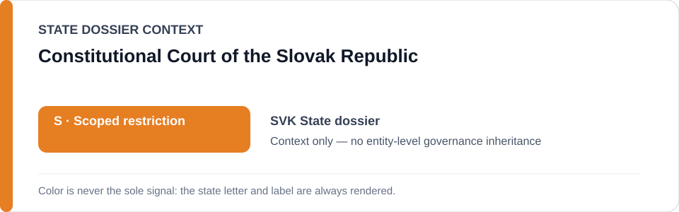
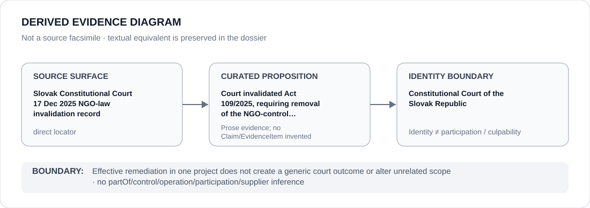

# Constitutional Court of the Slovak Republic

> **Canonical per-entity evidence/provenance record.** This dossier has no licensing effect by itself and carries no standalone `provisional_outcome`.

## Identity scope

Constitutional Court of the Slovak Republic, represented as the institution named in the canonical `SVK` State dossier for the repository-retained proposition below. Identity, mandate, adjudication, oversight, review, implementation or remediation activity does not itself create an ECL governance classification.

## State governance context

The canonical `SVK` State dossier records **S — Scoped restriction**. That State-level status is context only and is not inherited by Constitutional Court of the Slovak Republic.

## Evidence record

- **Source surface:** Slovak Constitutional Court 17 Dec 2025 NGO-law invalidation record.
- **Curated proposition:** Court invalidated Act 109/2025, requiring removal of the NGO-control component from current S scope.
- The proposition is preserved only at the granularity supported by the repository. It is not promoted into a new structured `Claim`, `EvidenceItem`, relation edge or Material Participation finding.
- State-dossier attribution remains separate from institution identity; evidence produced by, concerning or adjacent to an institution does not establish operation, control, culpability, supply, command or participation in conduct described elsewhere.

## Attribution and exclusions

Effective remediation in one project does not create a generic court outcome or alter unrelated scope. State `S`, institutional class membership and dossier/source adjacency do not propagate into a generic finding about Constitutional Court of the Slovak Republic.

## Visual evidence

The diagram encodes the retained source granularity as **direct** and terminates at the institution identity boundary.

## Evidence gaps

The retained repository source surface is sufficiently exact for the curated proposition above. That exactness is proposition-specific and does not establish broader institutional effectiveness, participation or governance.

## Sources

- [Canonical SVK State dossier](../states/SVK.md)
- https://www.ustavnysud.sk/en/actual-information/actuality/-/asset_publisher/B99toBHZi1uA/content/z%C3%A1kon-ktor%C3%BD-novelizuje-pr%C3%A1vnu-%C3%BApravu-mimovl%C3%A1dnych-organiz%C3%A1ci%C3%AD-je-v-rozpore-s-%C3%BAstavou

## Governance boundary

This migration records identity and provenance only. It changes no State outcome, scope, Schedule entry, actor relationship, licensing effect or entity-level governance status.
