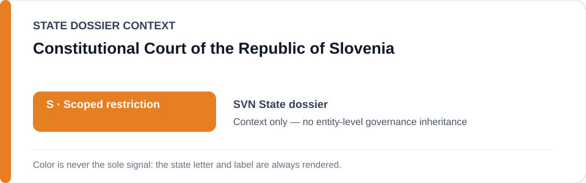
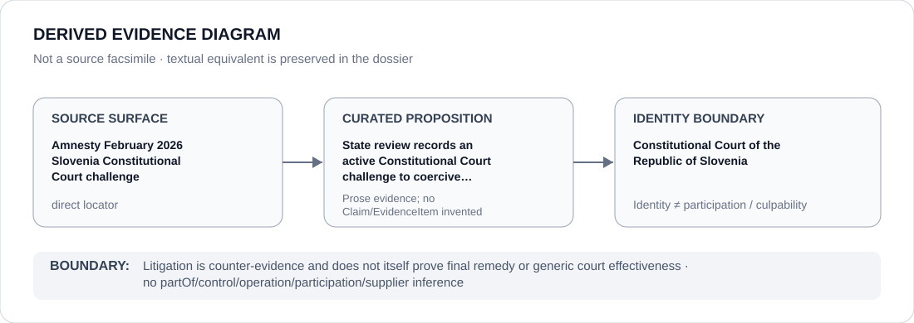

# Constitutional Court of the Republic of Slovenia

> **Canonical per-entity evidence/provenance record.** This dossier has no licensing effect by itself and carries no standalone `provisional_outcome`.

## Identity scope

Constitutional Court of the Republic of Slovenia, represented as the institution named in the canonical `SVN` State dossier for the repository-retained proposition below. Identity, mandate, adjudication, oversight, review, implementation or remediation activity does not itself create an ECL governance classification.

## State governance context

The canonical `SVN` State dossier records **S — Scoped restriction**. That State-level status is context only and is not inherited by Constitutional Court of the Republic of Slovenia.

## Evidence record

- **Source surface:** Amnesty February 2026 Slovenia Constitutional Court challenge.
- **Curated proposition:** State review records an active Constitutional Court challenge to coercive Security Law effects on vulnerable communities.
- The proposition is preserved only at the granularity supported by the repository. It is not promoted into a new structured `Claim`, `EvidenceItem`, relation edge or Material Participation finding.
- State-dossier attribution remains separate from institution identity; evidence produced by, concerning or adjacent to an institution does not establish operation, control, culpability, supply, command or participation in conduct described elsewhere.

## Attribution and exclusions

Litigation is counter-evidence and does not itself prove final remedy or generic court effectiveness. State `S`, institutional class membership and dossier/source adjacency do not propagate into a generic finding about Constitutional Court of the Republic of Slovenia.

## Visual evidence

The diagram encodes the retained source granularity as **direct** and terminates at the institution identity boundary.

## Evidence gaps

The retained repository source surface is sufficiently exact for the curated proposition above. That exactness is proposition-specific and does not establish broader institutional effectiveness, participation or governance.

## Sources

- [Canonical SVN State dossier](../states/SVN.md)
- https://www.amnesty.org/en/latest/news/2026/02/slovenia-amnesty-joins-constitutional-court-challenge-to-stop-vulnerable-communities-being-stripped-of-critical-social-support/

## Governance boundary

This migration records identity and provenance only. It changes no State outcome, scope, Schedule entry, actor relationship, licensing effect or entity-level governance status.
