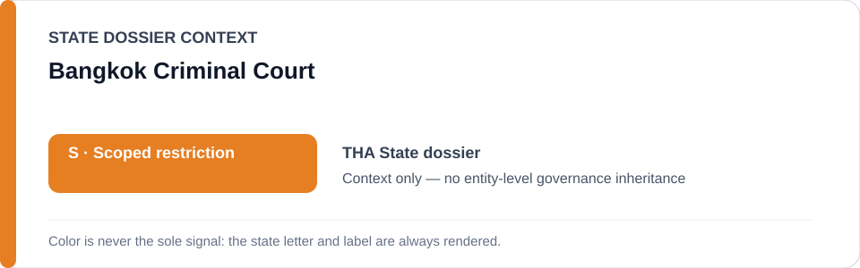
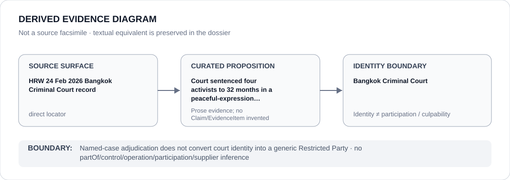

# Bangkok Criminal Court

> **Canonical per-entity evidence/provenance record.** This dossier has no licensing effect by itself and carries no standalone `provisional_outcome`.

## Identity scope

Bangkok Criminal Court, represented as the court associated in the `THA` State dossier with a named 2026 political-expression case. Naming the court in an adjudicative record is not itself a Restricted Party or ECL governance determination.

## State governance context

The canonical `THA` State dossier records **S — Scoped restriction** for political-expression/public-order enforcement and coordinated State cyber/information-control projects targeting protected peaceful activity. State `S` is context only and is not inherited by Bangkok Criminal Court.

## Evidence record

- The Thailand State dossier retains a 24 February 2026 Human Rights Watch locator reporting that a Bangkok criminal court sentenced four democracy/free-expression activists to 32 months' imprisonment under lèse-majesté-related charges arising from peaceful political speech.
- The State dossier separately records that the current renderable Schedule boundary is the named Bangkok Criminal Court black case Aor.498/2567 arising from the 29 November 2020 demonstration, limited to materially participating prosecution/detention functions.
- This entity dossier preserves the court's identity in that evidence surface without converting court identity, adjudication or institutional class membership into a generic restriction.

## Attribution and exclusions

A judgment or case association does not by itself establish which judicial, prosecutorial, detention or administrative functions materially satisfy an ECL criterion. This dossier creates no `partOf`, control, command, participation, culpability or Material Participation inference concerning Bangkok Criminal Court.

## Visual evidence

The diagram treats the named-case Human Rights Watch record as a direct evidence surface and terminates at court identity.

## Evidence gaps

The retained source is case-specific. It does not classify every Bangkok Criminal Court case, every court function or the Thai judiciary generally, and it does not independently resolve the capacity-level Schedule attribution.

## Sources

- [Canonical THA State dossier](../states/THA.md)
- [Human Rights Watch — Thailand: Free Speech Activists Get 32-Month Sentences](https://www.hrw.org/news/2026/02/24/thailand-free-speech-activists-get-32-month-sentences)

## Governance boundary

Named-case adjudication does not convert court identity into a generic Restricted Party. State `S`, case adjacency and the Schedule's capacity-limited project boundary do not propagate to Bangkok Criminal Court.
