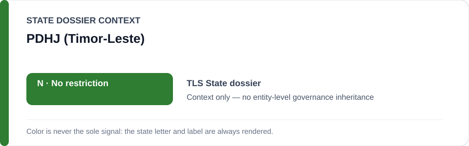
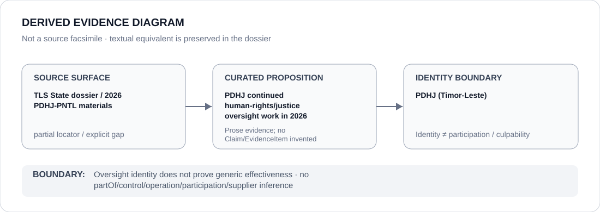

# PDHJ (Timor-Leste)

> **Canonical per-entity evidence/provenance record.** This dossier has no licensing effect by itself and carries no standalone `provisional_outcome`.

## Identity scope

The ABox entity `PDHJ (Timor-Leste)`, corresponding in the canonical Timor-Leste State dossier to the **Provedor for Human Rights and Justice**, represented only as the 2026 human-rights/justice oversight counter-institution preserved by repository provenance.

## State governance context

The canonical `TLS` State dossier records **N — No current State-level or defined-project basis**. It cites the Provedor/PDHJ, national-police human-rights work, courts and democratic contestation as counter-evidence. The green `N` is **context only** and is not inherited by PDHJ.

## Evidence record

- The Timor-Leste State dossier explicitly states that the Provedor for Human Rights and Justice continued human-rights-oriented institutional work in 2026.
- The same dossier treats PDHJ/PNTL human-rights policing and institutional materials as part of the counter-evidence against finding a current materially deployed ECL §5 prohibited project.
- The canonical source section retains those materials bibliographically rather than as exact URLs.

## Attribution and exclusions

Oversight activity does not prove generic effectiveness, complete remediation or absence of future abuse. Police/public-order conduct and any future digital identity, surveillance or enforcement systems are not attributed to PDHJ by institutional adjacency.

## Visual evidence

The diagram marks the source surface as partial because the current repository does not retain an exact 2026 PDHJ document URL.

## Evidence gaps

The exact 2026 PDHJ institutional material, report title, publication date, locator and case-level outcomes are not preserved in the current canonical corpus. Those details remain explicit gaps.

## Sources

- Canonical Timor-Leste State dossier: [`../states/TLS.md`](../states/TLS.md)
- Repository-retained source description: 2026 PDHJ/PNTL human-rights policing and institutional materials.

## Governance boundary

Oversight identity and State-level counter-evidence do not create a standalone ECL outcome for PDHJ. State `N` is context only and does not imply control, participation, culpability or generic effectiveness.
