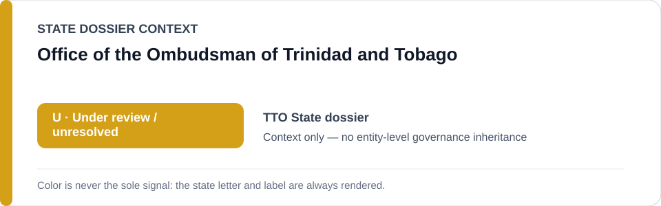
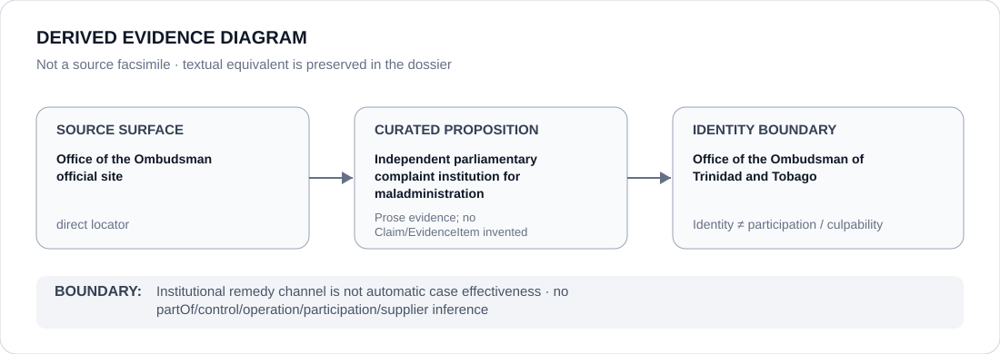

# Office of the Ombudsman of Trinidad and Tobago

> **Canonical per-entity evidence/provenance record.** This dossier has no licensing effect by itself and carries no standalone `provisional_outcome`.

## Identity scope

The Office of the Ombudsman of Trinidad and Tobago, represented as the independent parliamentary complaint institution for public-sector maladministration identified in the current migration/asylum State review.

## State governance context

The canonical `TTO` State dossier currently records **U — Under Review** after a prior `S` was downgraded because fresh systematic summary-return evidence was insufficient and several protection/remedy mechanisms remained active. The State `U` is **context only** and is not inherited by the Ombudsman.

## Evidence record

- The Trinidad and Tobago State dossier identifies the Office of the Ombudsman as an independent parliamentary institution for complaints of public-sector maladministration.
- It treats the Ombudsman together with registration, Special Inquiry, asylum-claim, appeal and supervised-release mechanisms as counter-evidence against preserving a stable active `S` without fresh systematic unlawful-return evidence.
- The dossier preserves a direct official Ombudsman locator.

## Attribution and exclusions

An available complaint institution does not prove effective remedy in every deportation, asylum or detention case. The Ombudsman is not attributed immigration detention, deportation decisions, summary-return conduct or implementation of the Migrant Registration Framework merely because its remedial function exists.

## Visual evidence

The diagram links the official Ombudsman surface to the limited proposition about institutional identity and complaint function, then stops at the institutional identity boundary.

## Evidence gaps

This dossier does not establish case-level use, outcomes, compliance rates or the effectiveness of Ombudsman remedies for the migration/asylum matters under review. Those propositions remain separate evidence questions.

## Sources

- [Office of the Ombudsman of Trinidad and Tobago](https://ombudsman.gov.tt/)
- [Canonical Trinidad and Tobago State dossier](../states/TTO.md)

## Governance boundary

Complaint jurisdiction and counter-evidence status do not create a standalone governance outcome for the Ombudsman. The amber `U` is State context only; institutional identity does not imply responsibility for the coercive projects being reviewed.
