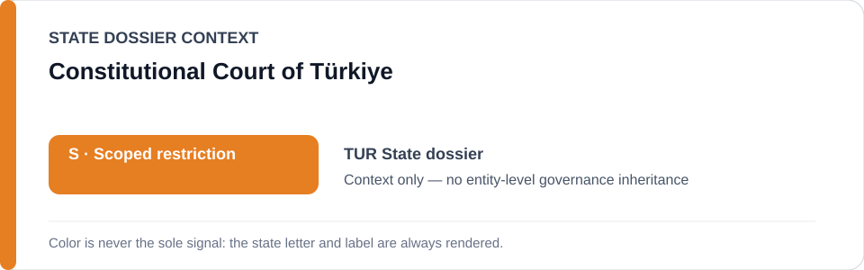
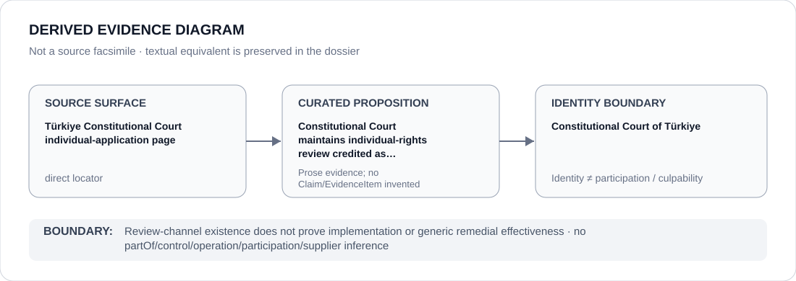

# Constitutional Court of Türkiye

> **Canonical per-entity evidence/provenance record.** This dossier has no licensing effect by itself and carries no standalone `provisional_outcome`.

## Identity scope

Constitutional Court of Türkiye, represented as the domestic constitutional counter-institution credited in the `TUR` State dossier. Constitutional-review identity and the existence of an individual-application channel are not themselves ECL governance classifications.

## State governance context

The canonical `TUR` State dossier records **S — Scoped restriction** for counterterrorism/security and prosecutorial political repression, coercive civic-space/association control, unlawful public-order enforcement and specified political information-blocking projects. State `S` is context only and is not inherited by Constitutional Court of Türkiye.

## Evidence record

- The Türkiye State dossier directly retains the Constitutional Court's official English-language individual-application page.
- The dossier credits continuing Constitutional Court individual-rights review, together with ECtHR review, as counter-evidence that makes whole-State attribution overbroad.
- The retained official surface establishes the review channel and institutional activity only; it is not promoted into proof that every ruling is implemented or that every politically sensitive matter receives effective remediation.

## Attribution and exclusions

Constitutional review of State conduct does not establish operation, control, authorship, implementation or participation in the security, prosecutorial, civic-control, public-order or information-blocking projects under review. No Material Participation or culpability inference is created.

## Visual evidence

The diagram treats the official individual-application page as a direct evidence surface and terminates at Constitutional Court identity.

## Evidence gaps

The retained source does not quantify compliance with Constitutional Court rulings, resolve effectiveness across every rights category or establish generic institutional independence.

## Sources

- [Canonical TUR State dossier](../states/TUR.md)
- [Constitutional Court of Türkiye — individual application](https://www.anayasa.gov.tr/en/news/individual-application/)

## Governance boundary

Review-channel existence does not prove implementation or generic remedial effectiveness. State `S` and counter-evidence adjacency do not propagate to Constitutional Court of Türkiye.
