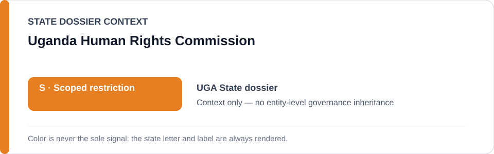
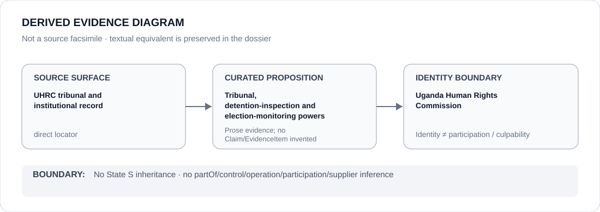

# Uganda Human Rights Commission

> **Canonical per-entity evidence/provenance record.** This dossier has no licensing effect by itself and carries no standalone `provisional_outcome`.

## Identity scope

The Uganda Human Rights Commission (UHRC), represented as the constitutional human-rights institution with tribunal and monitoring functions described in the canonical Uganda dossier.

## State governance context

The canonical `UGA` State dossier currently records **S — Scoped restriction**. That status is shown below as **context only**. It is not inherited by the Uganda Human Rights Commission.

## Evidence record

- The Uganda State dossier records UHRC as a constitutional institution with tribunal powers to investigate, order release or compensation, inspect detention and monitor elections.
- UHRC and other remedial functions are expressly excluded from the State's active scoped restriction.
- The historical `R → S` correction preserved in the State dossier specifically cites UHRC's real tribunal/remedial powers and institutional activity as a reason whole-State attribution was overbroad.

## Attribution and exclusions

This dossier does not infer that UHRC controls military, intelligence or police conduct; does not claim universal compliance with UHRC orders; and does not give UHRC a standalone `S` status or remediation score.

## Visual evidence

The diagram is derived from the tribunal/institutional record and the State dossier's attribution boundary. It is not a source facsimile.

## Evidence gaps

The corpus does not yet represent individual UHRC orders, inspections and election-monitoring interventions as separate structured Claim/EvidenceItem records. Compliance with particular orders remains case-specific.

## Sources

- [UHRC — tribunal](https://uhrc.ug/page/about-tribunal)
- [UHRC — institutional information](https://uhrc.ug/about/)
- [UHRC — annual reports](https://uhrc.ug/download-category/annual-reports/)
- [Canonical State dossier provenance](../states/UGA.md)

## Governance boundary

Identity, tribunal powers, reporting or visual adjacency do not create `partOf`, control, operation, participation, command, culpability or Material Participation relations. Any such relation requires separate structured curation.

The orange `S` State-context color is a rendering aid only, not an institution-level designation.
