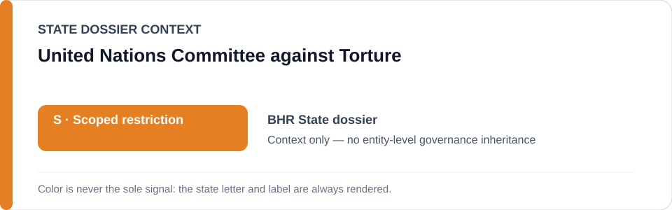
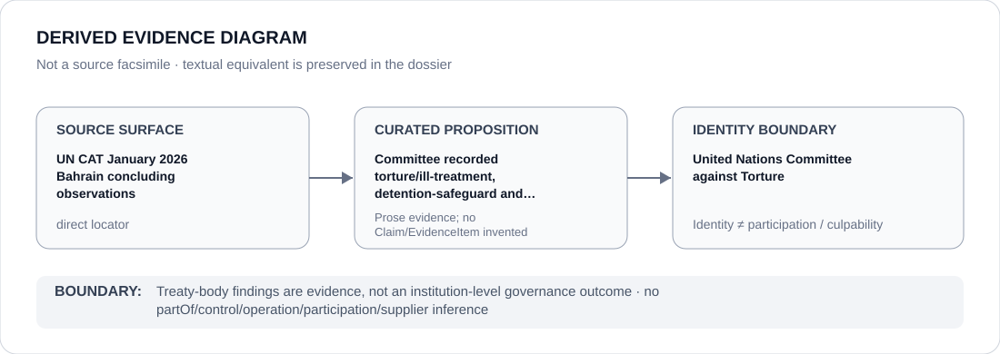

# United Nations Committee against Torture

> **Canonical per-entity evidence/provenance record.** This dossier has no licensing effect by itself and carries no standalone `provisional_outcome`.

## Identity scope

United Nations Committee against Torture, represented as the institution named in the `BHR` State dossier for the exact evidence proposition preserved below. Institutional identity, review, adjudication, monitoring or reporting is not itself an ECL governance classification.

## State governance context

The canonical `BHR` State dossier records **S — Scoped restriction** with scope concerning security/intelligence/law-enforcement and detention systems materially involved in torture, incommunicado/unofficial detention, political retaliation or coercive interrogation, plus materially enabling justice projects in substantiated cases. State `S` is context only and is not inherited by United Nations Committee against Torture.

## Evidence record

- The Bahrain State dossier retains the Committee's January 2026 concluding observations as its direct source surface.
- That retained record describes consistent reports of torture or ill-treatment involving law-enforcement, prison, military and intelligence personnel, together with safeguards failures, unofficial or incommunicado detention concerns, deaths in custody, retaliation and accountability concerns.
- The same source is also used for counter-evidence: prison-health transfer reforms, alternative sentencing, restorative juvenile justice and specialized juvenile institutions were credited rather than erased.

## Attribution and exclusions

The retained source proposition concerns evidence, adjudication, monitoring, review or accountability activity by the named institution. It does not establish operation, control, ownership, command, implementation, supply or Material Participation in the State/project conduct described elsewhere in the `BHR` dossier.

## Visual evidence

The diagram treats the retained locator as a direct evidence surface and terminates at the institution identity boundary.

## Evidence gaps

This dossier preserves what the State dossier attributes to the January 2026 concluding observations. It does not convert every allegation or recommendation in the wider treaty-body record into a separately verified ECL proposition.

## Sources

- [Canonical BHR State dossier](../states/BHR.md)
- [UN CAT January 2026 Bahrain concluding observations](https://docstore.ohchr.org/SelfServices/FilesHandler.ashx?enc=%2F0aLqb%2BD86wFVEqMSMj7marJZz7q6eZ6uue7ppBVcvL3oDOFbTK%2F91v4HcvhDP%2FDvPnT%2BfyBG2imgEaPIfezcQ%3D%3D)

## Governance boundary

Treaty-body findings are evidence, not an institution-level governance outcome. State `S` and source adjacency do not propagate to United Nations Committee against Torture.
