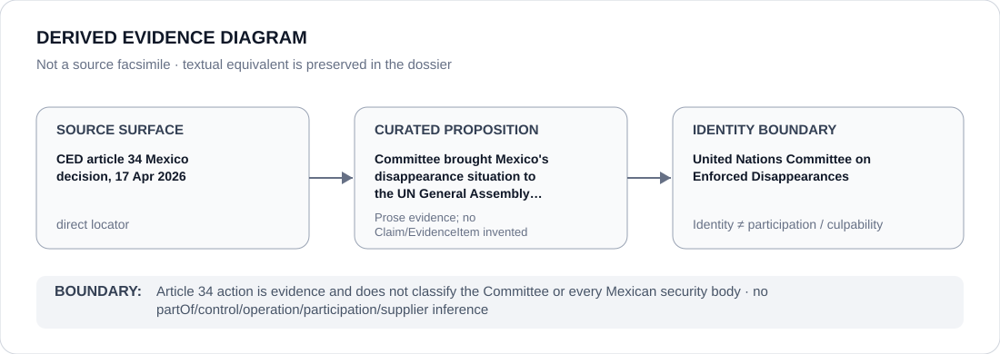

# United Nations Committee on Enforced Disappearances

> **Canonical per-entity evidence/provenance record.** This dossier has no licensing effect by itself and carries no standalone `provisional_outcome`.

## Identity scope

United Nations Committee on Enforced Disappearances, represented as the institution named in the `MEX` State dossier for the exact evidence proposition preserved below. Institutional identity, review, adjudication, monitoring or reporting is not itself an ECL governance classification.

## State governance context

The canonical `MEX` State dossier records **S — Scoped restriction** with scope concerning identified security and military-public-security projects materially involved in enforced disappearance, torture, coercive detention/targeting, official collusion/acquiescence or obstruction of search/accountability. State `S` is context only and is not inherited by United Nations Committee on Enforced Disappearances.

## Evidence record

- The Mexico State dossier retains the Committee's article 34 decision as a direct, proposition-specific locator.
- It records that on 17 April 2026 the Committee decided to bring Mexico's situation to the attention of the UN General Assembly after reviewing information concerning widespread or systematic enforced disappearance, persistent impunity, alleged public-official involvement or acquiescence and serious deficiencies in search and investigation.
- The State dossier also preserves the source's attribution boundary: the disappearance record includes direct State involvement, alleged official-criminal collusion and substantial disappearance activity attributable to non-State actors.

## Attribution and exclusions

The retained source proposition concerns evidence, adjudication, monitoring, review or accountability activity by the named institution. It does not establish operation, control, ownership, command, implementation, supply or Material Participation in the State/project conduct described elsewhere in the `MEX` dossier.

## Visual evidence

The diagram treats the retained locator as a direct evidence surface and terminates at the institution identity boundary.

## Evidence gaps

The article 34 decision does not establish that every Mexican security, military, search or justice institution participates in the same project. Entity- and project-specific attribution remains required.

## Sources

- [Canonical MEX State dossier](../states/MEX.md)
- [CED article 34 Mexico decision, 17 Apr 2026](https://docs.un.org/en/CED/C/MEX/A.34/D/1)

## Governance boundary

Article 34 action is evidence and does not classify the Committee or every Mexican security body. State `S` and source adjacency do not propagate to United Nations Committee on Enforced Disappearances.
