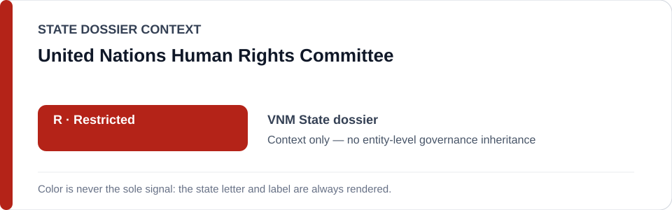
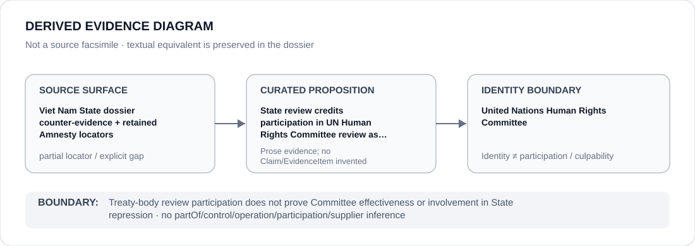

# United Nations Human Rights Committee

> **Canonical per-entity evidence/provenance record.** This dossier has no licensing effect by itself and carries no standalone `provisional_outcome`.

## Identity scope

United Nations Human Rights Committee, represented as the treaty body named in the `VNM` State dossier's counter-evidence. Participation in treaty-body review is an external accountability/remediation channel and is not itself an ECL governance classification.

## State governance context

The canonical `VNM` State dossier records **R — State apparatus Restricted** for the political-security, prosecution, prison, information-control and transnational-repression apparatus. The same dossier credits Viet Nam's participation in UN Human Rights Committee review as partial counter-evidence. State `R` is context only and is not inherited by the Committee.

## Evidence record

- The Viet Nam dossier expressly states that Viet Nam participates in UN Human Rights Committee review and treats that participation as counter-evidence alongside death-penalty narrowing.
- The canonical State source list retains two Amnesty locators, but does not preserve a Committee session, concluding-observations, communication or other proposition-specific UN locator for the review proposition.
- The institution dossier therefore preserves the proposition exactly at State-dossier granularity rather than reconstructing a missing treaty-body document externally.

## Attribution and exclusions

Treaty-body identity, review participation or source adjacency does not establish control, operation, implementation, supply, Material Participation or culpability in the Vietnamese State conduct described elsewhere in the State dossier.

## Visual evidence

The diagram marks the source surface as `partial` and terminates at the Committee identity boundary.

## Evidence gaps

The current repository does not retain a one-to-one UN Human Rights Committee locator for the review proposition. No finding is made here about the effectiveness, implementation or outcome of that review beyond the counter-evidence characterization already present in the State dossier.

## Sources

- [Canonical Viet Nam State dossier](../states/VNM.md)
- [Amnesty Viet Nam country record retained by the State dossier](https://www.amnesty.org/en/location/asia-and-the-pacific/south-east-asia-and-the-pacific/viet-nam/report-viet-nam/)
- [Amnesty 2026 Viet Nam document retained by the State dossier](https://www.amnesty.org/en/documents/asa41/1252/2026/en/)

## Governance boundary

Treaty-body review participation does not prove Committee effectiveness or involvement in State repression. State `R` and source adjacency do not propagate to the United Nations Human Rights Committee.
