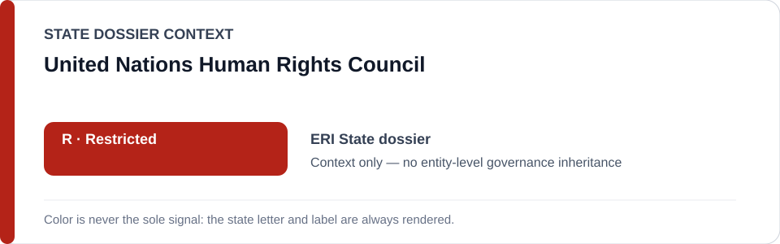
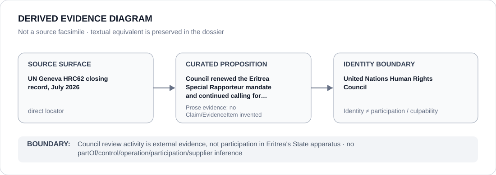

# United Nations Human Rights Council

> **Canonical per-entity evidence/provenance record.** This dossier has no licensing effect by itself and carries no standalone `provisional_outcome`.

## Identity scope

United Nations Human Rights Council, represented as the institution named in the `ERI` State dossier for the exact evidence proposition preserved below. Institutional identity, review, adjudication, monitoring or reporting is not itself an ECL governance classification.

## State governance context

The canonical `ERI` State dossier records **R — Restricted** with scope concerning State governing, detention, national-service and security apparatus. State `R` is context only and is not inherited by United Nations Human Rights Council.

## Evidence record

- The Eritrea State dossier retains the July 2026 UN Geneva Human Rights Council session record as a direct source surface.
- The dossier records that the Council renewed the Special Rapporteur mandate and continued calling on Eritrea to cooperate fully with OHCHR and the mandate.
- The same review record is not used one-sidedly: the State dossier also credits OHCHR human-rights training in Asmara and release of some arbitrarily detained persons as counter-evidence.

## Attribution and exclusions

The retained source proposition concerns evidence, adjudication, monitoring, review or accountability activity by the named institution. It does not establish operation, control, ownership, command, implementation, supply or Material Participation in the State/project conduct described elsewhere in the `ERI` dossier.

## Visual evidence

The diagram treats the retained locator as a direct evidence surface and terminates at the institution identity boundary.

## Evidence gaps

This dossier does not treat a Human Rights Council mandate renewal as independent proof of every underlying Eritrea allegation, nor does it infer the Council's effectiveness from the existence of the review mechanism.

## Sources

- [Canonical ERI State dossier](../states/ERI.md)
- [UN Geneva HRC62 closing record, July 2026](https://www.ungeneva.org/en/news-media/press-release/2026/07/human-rights-council-concludes-sixty-second-regular-session-after)

## Governance boundary

Council review activity is external evidence, not participation in Eritrea's State apparatus. State `R` and source adjacency do not propagate to United Nations Human Rights Council.
