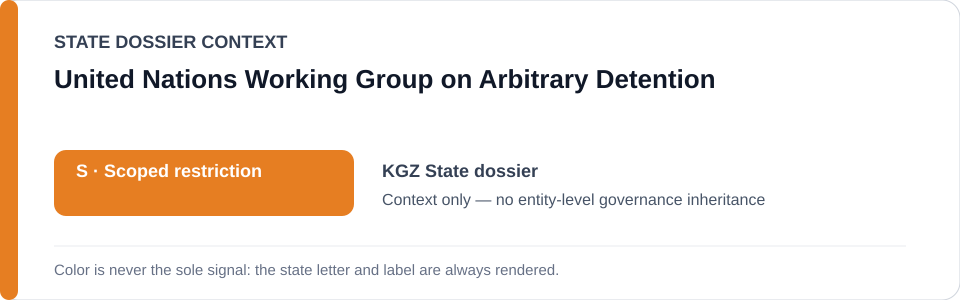
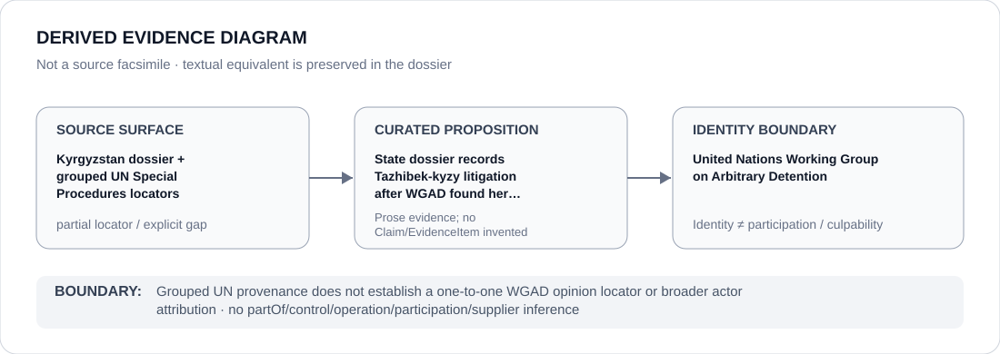

# United Nations Working Group on Arbitrary Detention

> **Canonical per-entity evidence/provenance record.** This dossier has no licensing effect by itself and carries no standalone `provisional_outcome`.

## Identity scope

United Nations Working Group on Arbitrary Detention (WGAD), represented as the UN Special Procedures mechanism named in the `KGZ` State dossier in connection with the Makhabat Tazhibek-kyzy matter. An opinion or review function is evidence activity, not an ECL governance outcome for the Working Group.

## State governance context

The canonical `KGZ` State dossier records **S — Scoped restriction** for identified security/prosecutorial political-detention or torture, coercive media/civic-control, and discriminatory or vague extremism/religious-enforcement projects. State `S` is context only and is not inherited by WGAD.

## Evidence record

- The Kyrgyzstan dossier records continuing 2026 litigation concerning journalist Makhabat Tazhibek-kyzy after the UN Working Group on Arbitrary Detention found her detention arbitrary.
- The repository retains exact named-case Amnesty/24.kg locators for the continuing proceeding and two historical UN Special Procedures `SummaryPrint` locators.
- The State dossier expressly warns that the historical UN record grouped multiple propositions around those two locators without preserving a one-to-one proposition mapping. This entity dossier therefore does not claim that either retained UN URL is the exact WGAD opinion locator.

## Attribution and exclusions

WGAD's identity, an arbitrary-detention opinion, Special Procedures adjacency or subsequent litigation does not establish participation in Kyrgyz security/prosecutorial conduct, control of a proceeding or any generic governance outcome for the Working Group.

## Visual evidence

The diagram preserves the grouped-source limitation and terminates at WGAD identity.

## Evidence gaps

The repository does not preserve a one-to-one mapping between the exact WGAD opinion and a specific retained UN locator. The named-case proposition is preserved, but finer source mapping remains intentionally unresolved.

## Sources

- [Canonical Kyrgyzstan State dossier](../states/KGZ.md)
- [Historical UN Special Procedures summary locator 28872](https://spcommreports.ohchr.org/TmSearch/SummaryPrint?id=28872)
- [Historical UN Special Procedures summary locator 30217](https://spcommreports.ohchr.org/TmSearch/SummaryPrint?id=30217)
- [Amnesty January 2026 Tazhibek-kyzy record](https://www.amnesty.org/en/latest/news/2026/01/kyrgyzstan-authorities-must-free-journalist-makhabat-tazhibek-kyzy-and-quash-her-wrongful-conviction/)

## Governance boundary

Grouped UN provenance does not establish a one-to-one WGAD opinion locator or broader actor attribution. State `S` does not propagate to WGAD.
