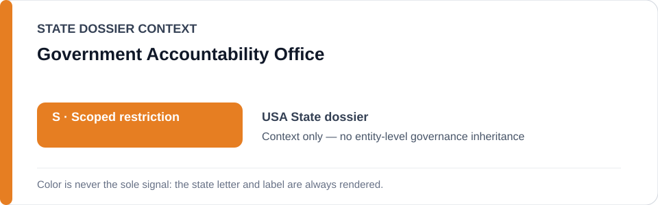
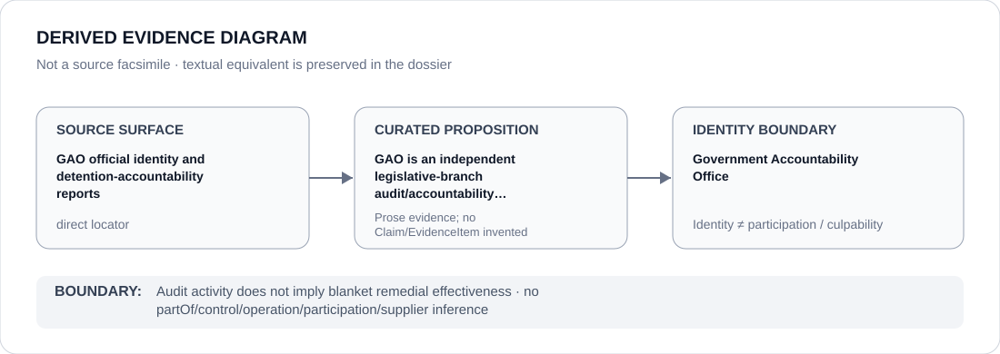

# Government Accountability Office

> **Canonical per-entity evidence/provenance record.** This dossier has no licensing effect by itself and carries no standalone `provisional_outcome`.

## Identity scope

The U.S. Government Accountability Office (GAO), represented as the independent, non-partisan legislative-branch audit/accountability institution explicitly used as counter-evidence in the United States State dossier.

## State governance context

The canonical `USA` State dossier records **S — Restricted with defined scope** after narrowing a former whole-federal `R`. GAO and independent audit activity are expressly excluded from generic scope and materially support the narrowest-accurate-attribution correction. The red `S` is **State context only** and is not inherited by GAO.

## Evidence record

- The United States dossier identifies GAO as an independent, non-partisan legislative-branch accountability institution and preserves a direct GAO identity locator.
- It also retains GAO reports as detention-accountability/counter-evidence provenance, including a historical report recovered during evidence absorption.
- In the formal Exergism layer, counter-institution evidence contributes to higher contestability/truth-access values and lower whole-apparatus capture assumptions, but it does not mechanically determine the tier.
- The current Schedule freeze is a distinct Operation Epic Fury/Minab project and does not include GAO.

## Attribution and exclusions

Audit activity does not prove complete remediation, effective implementation of recommendations or accountability across every federal project. Conversely, federal detention, military targeting, immigration or surveillance projects are not attributed to GAO merely because GAO audits government activity.

## Visual evidence

The diagram links official GAO identity/report surfaces to the limited proposition that GAO is a distinct legislative-branch accountability institution used as counter-evidence, then stops at the identity boundary.

## Evidence gaps

This dossier does not assess recommendation implementation, agency compliance, audit coverage completeness or GAO effectiveness across all scoped federal projects.

## Sources

- [GAO — About](https://www.gao.gov/about)
- [GAO-26-108886](https://www.gao.gov/products/gao-26-108886)
- [GAO-25-107580](https://www.gao.gov/products/gao-25-107580)
- [Canonical United States State dossier](../states/USA.md)

## Governance boundary

Independent audit identity and counter-evidence status do not create a favorable ECL tier for GAO. State `S`, federal association and report provenance do not imply control, participation or responsibility for a Restricted Project.
