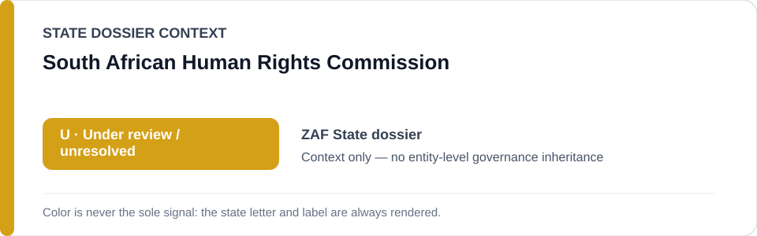
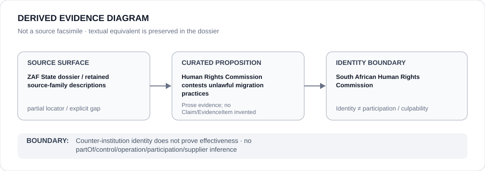

# South African Human Rights Commission

> **Canonical per-entity evidence/provenance record.** This dossier has no licensing effect by itself and carries no standalone `provisional_outcome`.

## Identity scope

The South African Human Rights Commission (SAHRC), represented as the human-rights counter-institution named alongside courts and civil society in the current South Africa migration-enforcement review.

## State governance context

The canonical `ZAF` State dossier records **U — Under Review** after current State-linked migration operations defeated the former clean `N`, while attribution and the exact ECL technology/project nexus remain unresolved. SAHRC is excluded/counter-evidence in that analysis. The amber `U` is **context only** and is not inherited by the Commission.

## Evidence record

- The South Africa State dossier states that courts, the Human Rights Commission and civil-society organisations actively contest unlawful migration practices.
- It expressly excludes SAHRC, courts and humanitarian/remedial functions from the State-linked migration operations under review absent separate evidence.
- The repository's normalized State source section preserves source-family/bibliographic descriptions rather than exact URLs for the 2026 migration-enforcement reporting.

## Attribution and exclusions

Being named as a counter-institution does not prove SAHRC effectiveness, independence in every matter, case outcomes or compliance by State agencies. State migration operations, non-State vigilante conduct and data/surveillance concerns are not attributed to SAHRC.

## Visual evidence

The diagram deliberately marks the source surface as partial because the repository itself records the relevant source families without exact locators.

## Evidence gaps

No exact 2026 SAHRC report, complaint, case, decision or source URL supporting the specific migration-practices proposition is retained in the current canonical corpus. This dossier preserves that gap rather than fabricating a locator.

## Sources

- Canonical South Africa State dossier: [`../states/ZAF.md`](../states/ZAF.md)
- Repository-retained bibliographic source family: Amnesty International South Africa country record 2025/26.
- Repository-retained source family: current 2026 government, court and civil-society migration-enforcement reporting.

## Governance boundary

Counter-institution status and exclusion from an adverse project do not create a favorable governance score for SAHRC. State `U` is context only; identity does not imply participation in migration enforcement or responsibility for non-State xenophobic conduct.
