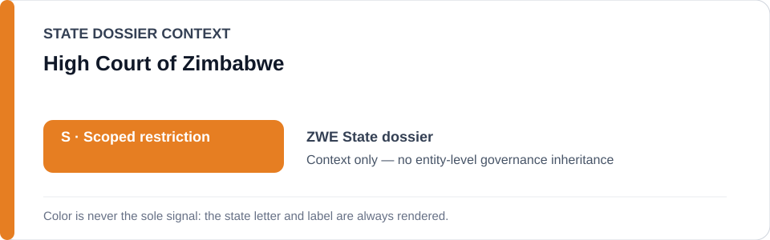
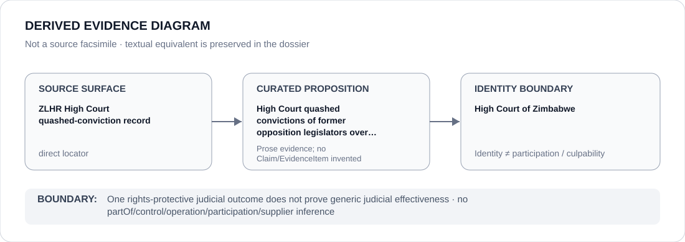

# High Court of Zimbabwe

> **Canonical per-entity evidence/provenance record.** This dossier has no licensing effect by itself and carries no standalone `provisional_outcome`.

## Identity scope

High Court of Zimbabwe, represented as the institution named in the `ZWE` State dossier for the exact evidence proposition preserved below. Institutional identity, review, adjudication, monitoring or reporting is not itself an ECL governance classification.

## State governance context

The canonical `ZWE` State dossier records **S — Scoped restriction** with scope concerning police/security/intelligence and executive-administrative projects involved in political detention, surveillance/harassment, violent suppression of peaceful meetings/protest, coercive civil-society controls and term-extension enforcement. State `S` is context only and is not inherited by High Court of Zimbabwe.

## Evidence record

- The Zimbabwe State dossier retains an exact Zimbabwe Lawyers for Human Rights locator describing a High Court decision quashing convictions of former opposition legislators over an unsanctioned gathering.
- That judicial outcome is preserved as counter-evidence supporting the State dossier's conclusion that functioning rights-protective courts still defeat whole-State attribution.
- The State dossier separately records other judicial acquittals and invalidation of unconstitutional provisions, but this canonical entity dossier does not merge those distinct matters into the exact retained High Court locator.

## Attribution and exclusions

The retained source proposition concerns evidence, adjudication, monitoring, review or accountability activity by the named institution. It does not establish operation, control, ownership, command, implementation, supply or Material Participation in the State/project conduct described elsewhere in the `ZWE` dossier.

## Visual evidence

The diagram treats the retained locator as a direct evidence surface and terminates at the institution identity boundary.

## Evidence gaps

The retained High Court decision is one counter-evidence proposition. It does not establish blanket independence, effectiveness or remediation across Zimbabwe's judiciary, and it does not negate separately attributed executive/security projects.

## Sources

- [Canonical ZWE State dossier](../states/ZWE.md)
- [ZLHR High Court quashed-conviction record](https://www.zlhr.org.zw/high-court-quashes-conviction-of-former-opposition-legislators-over-unsanctioned-gathering/)

## Governance boundary

One rights-protective judicial outcome does not prove generic judicial effectiveness. State `S` and source adjacency do not propagate to High Court of Zimbabwe.
