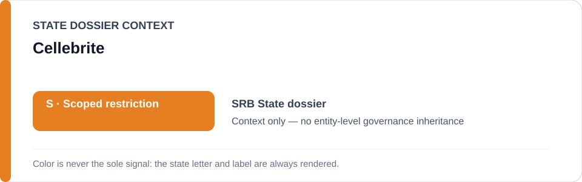
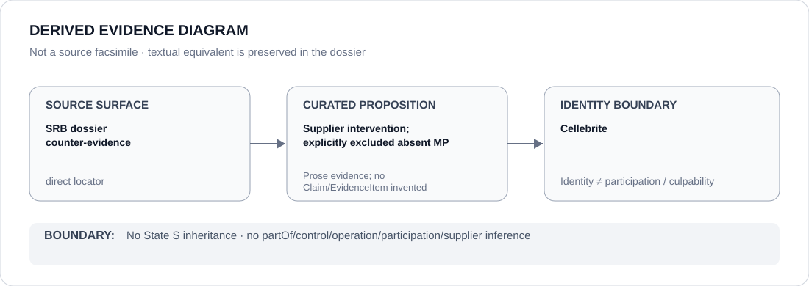

# Cellebrite

> **Canonical per-entity evidence/provenance record.** This dossier has no licensing effect by itself and carries no standalone `provisional_outcome`.

## Identity scope

Cellebrite, represented here only as the private technology vendor named in the canonical Serbia dossier's counter-evidence and Schedule boundary. This dossier records an organization identity and the evidentiary significance of supplier intervention; it does not classify Cellebrite as a Serbian State actor.

## State governance context

The canonical `SRB` State dossier records **S — Scoped restriction** for a narrow class of Serbian repressive spyware/mobile-forensic and separately substantiated protest-repression projects. State `S` is **context only** and is not inherited by Cellebrite.

## Evidence record

- The Serbia dossier records that Cellebrite halted product use in Serbia after surveillance reporting, treating that intervention as **counter-evidence** that supplier action can reduce technical capability.
- The same dossier expressly states that Cellebrite is **not a Serbian Restricted Party merely because its technology was misused**.
- `promoted-ready-01.yml` excludes suppliers absent their own Material Participation from the Serbian renderable class.

## Attribution and exclusions

Technology involvement, vendor identity and supplier intervention do not by themselves prove supply into a qualifying project, operation, control, participation, knowledge, intent or Material Participation. No such relation is asserted by this dossier.

## Visual evidence

The diagram treats supplier intervention as a curated counter-evidence proposition and keeps the organization outside inherited State governance.

## Evidence gaps

The repository does not currently encode a separate Material Participation finding for Cellebrite in the Serbian projects. Any future supplier-level governance would require its own evidence and adjudication rather than inference from product presence.

## Sources

- [Canonical Serbia State dossier](../states/SRB.md)
- [Promoted-ready Schedule freeze](../../registry/schedule-state-s-freezes/promoted-ready-01.yml)
- [Amnesty — A Digital Prison: Surveillance and the suppression of civil society in Serbia](https://www.amnesty.org/en/documents/eur70/8813/2024/en/)

## Governance boundary

Vendor identity, technology presence and remedial intervention do not establish Material Participation or make Cellebrite a Serbian Restricted Party. No supply, operation, participation, control or governance relation is created here. The orange `S` is State context only.
