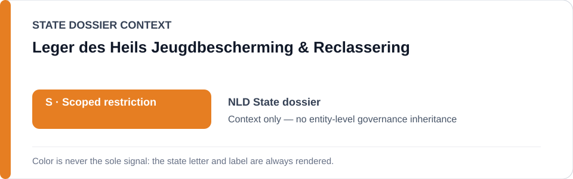
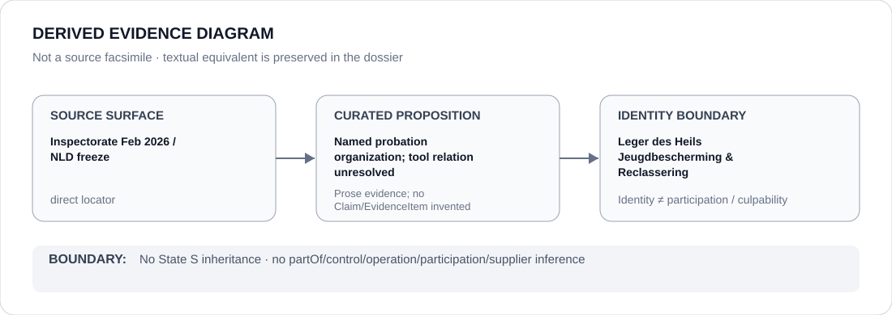

# Leger des Heils Jeugdbescherming & Reclassering

> **Canonical per-entity evidence/provenance record.** This dossier has no licensing effect by itself and carries no standalone `provisional_outcome`.

## Identity scope

Leger des Heils Jeugdbescherming & Reclassering, represented as one of the Dutch probation organizations named in the Netherlands algorithm-risk provenance. The dossier records organization identity only; no algorithm-operation relation is created.

## State governance context

The canonical `NLD` State dossier records **S — Scoped restriction** for the named `STATIC-99R`, `STABLE-2007` and `ACUTE-2007` workflows while the February 2026 Inspectorate finding remains unremediated. State `S` is **context only** and is not inherited by this organization.

## Evidence record

- The Inspectorate's February 2026 investigation addresses the Dutch probation organizations collectively and found non-demonstrably-responsible use of the three named risk tools.
- The status-resolved NLD freeze retains only those three workflows and expressly excludes OXREC while suspended.
- The ABox intentionally does not infer that Leger des Heils operates every named tool or that a collective oversight finding determines organization-specific remediation status.

## Attribution and exclusions

No specific tool operation, model ownership, scoring decision, criminal-justice recommendation or present remediation state is attributed to this organization merely from its inclusion in the collective probation-services record. Courts, oversight/remediation and corrected or independently validated systems remain outside the active scope.

## Visual evidence

The diagram records a named probation organization within collective evidence and preserves the absence of a specific operator→tool edge.

## Evidence gaps

The repository lacks a proposition-specific current deployment map linking this organization to each risk tool and confirming remediation state at operator level. No such relation is fabricated here.

## Sources

- [Justice and Security Inspectorate — risky algorithm use by probation services](https://www.inspectie-jenv.nl/actueel/nieuws/2026/02/12/risicovol-algoritmegebruik-door-reclassering)
- [Inspectorate report](https://www.inspectie-jenv.nl/documenten/2026/02/12/rapport-risicovol-algoritmegebruik)
- [Canonical Netherlands State dossier](../states/NLD.md)
- [NLD status-resolved Schedule freeze](../../registry/schedule-state-s-freezes/status-resolved-nld.yml)

## Governance boundary

Collective probation-service evidence does not create specific algorithm operation, organization-wide culpability, State-governance inheritance or Material Participation. The orange `S` is State context only.
