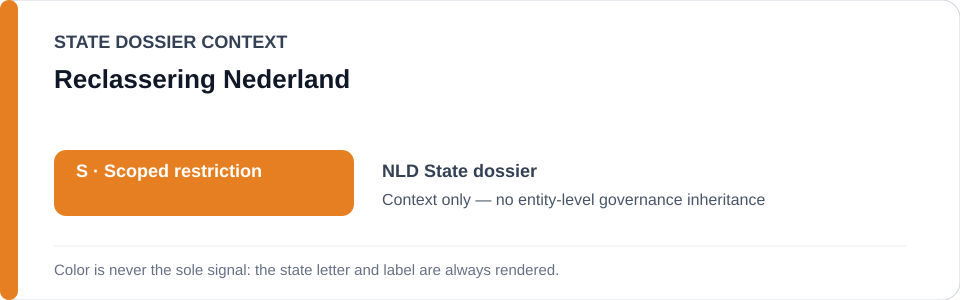
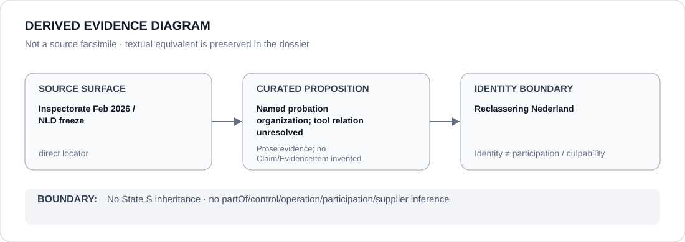

# Reclassering Nederland

> **Canonical per-entity evidence/provenance record.** This dossier has no licensing effect by itself and carries no standalone `provisional_outcome`.

## Identity scope

Reclassering Nederland, one of the Dutch probation organizations named in the Netherlands algorithm-risk record. This dossier establishes only the organization identity and its appearance in the curated probation-tool provenance; it does not encode operation of any particular algorithm.

## State governance context

The canonical `NLD` State dossier currently records **S — Scoped restriction**, limited to `STATIC-99R`, `STABLE-2007` and `ACUTE-2007` probation risk-assessment workflows while the February 2026 Inspectorate finding of non-demonstrably-responsible use remains unremediated. That status is **State context only** and is not inherited by Reclassering Nederland.

## Evidence record

- The Justice and Security Inspectorate's 12 February 2026 investigation found that the Dutch probation organizations did not use `STATIC-99R`, `STABLE-2007` and `ACUTE-2007` in a demonstrably responsible manner.
- The current NLD Schedule freeze defines the project boundary as use of those three named tools **by the Dutch probation organizations** while that finding remains unremediated.
- The ABox record nevertheless remains identity-only: current operation by this particular organization, tool-by-tool deployment and remediation status are separate propositions and are not inferred from collective wording.

## Attribution and exclusions

Membership in the set of Dutch probation organizations named by the Inspectorate does not establish which tool Reclassering Nederland currently operates, at what sites, in what capacity, or whether a particular deployment has been corrected or independently validated. OXREC while suspended, corrected/validated systems, courts and oversight/remediation are excluded from the active State scope.

## Visual evidence

The diagram preserves the collective probation-organization finding while stopping before any unsupported organization→tool operation edge.

## Evidence gaps

The repository does not yet contain a proposition-specific Claim mapping Reclassering Nederland to each named risk tool or resolving current remediation status by operator. That gap is retained explicitly rather than inferred from the State dossier.

## Sources

- [Justice and Security Inspectorate — risky algorithm use by probation services](https://www.inspectie-jenv.nl/actueel/nieuws/2026/02/12/risicovol-algoritmegebruik-door-reclassering)
- [Inspectorate report](https://www.inspectie-jenv.nl/documenten/2026/02/12/rapport-risicovol-algoritmegebruik)
- [Canonical Netherlands State dossier](../states/NLD.md)
- [NLD status-resolved Schedule freeze](../../registry/schedule-state-s-freezes/status-resolved-nld.yml)

## Governance boundary

Organization identity and collective oversight findings do not create a specific operation relation, organization-wide culpability, State-governance inheritance or Material Participation. The orange `S` is State context only.
