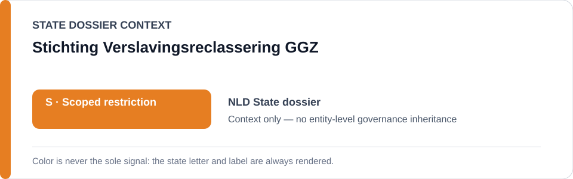
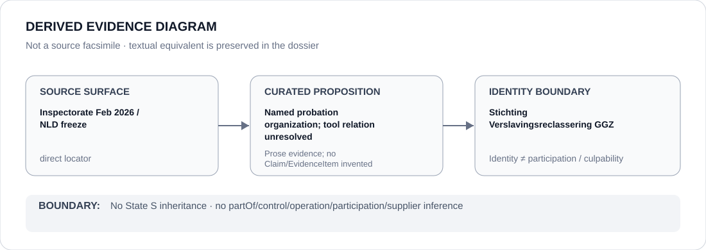

# Stichting Verslavingsreclassering GGZ

> **Canonical per-entity evidence/provenance record.** This dossier has no licensing effect by itself and carries no standalone `provisional_outcome`.

## Identity scope

Stichting Verslavingsreclassering GGZ, represented as one of the Dutch probation organizations named in the Netherlands algorithm-risk provenance. This is an organization-identity dossier and not an assertion that the organization operates any specific risk tool.

## State governance context

The canonical `NLD` State dossier records **S — Scoped restriction** only for `STATIC-99R`, `STABLE-2007` and `ACUTE-2007` while the February 2026 Inspectorate finding remains unremediated. That State status is **context only** and is not inherited by Stichting Verslavingsreclassering GGZ.

## Evidence record

- The February 2026 Inspectorate record addresses the Dutch probation organizations collectively and found that the three named risk tools were not used in a demonstrably responsible manner.
- The later status-resolved freeze narrows the renderable class to those three tools and credits OXREC suspension as remediation.
- The ABox record deliberately leaves tool operation and organization-specific remediation unresolved rather than converting collective language into a specific relation.

## Attribution and exclusions

This dossier does not infer operation of `STATIC-99R`, `STABLE-2007`, `ACUTE-2007` or OXREC by this organization. It does not infer model ownership, scoring responsibility or a present unremediated deployment. Corrected/validated systems, courts and oversight/remediation are excluded from the active State scope.

## Visual evidence

The diagram preserves organization identity and collective-source provenance without adding an unsupported operator relation.

## Evidence gaps

No current proposition-specific deployment map in the repository establishes which named tools this organization operates or whether operator-level remediation is complete. Those facts require separate evidence.

## Sources

- [Justice and Security Inspectorate — risky algorithm use by probation services](https://www.inspectie-jenv.nl/actueel/nieuws/2026/02/12/risicovol-algoritmegebruik-door-reclassering)
- [Inspectorate report](https://www.inspectie-jenv.nl/documenten/2026/02/12/rapport-risicovol-algoritmegebruik)
- [Canonical Netherlands State dossier](../states/NLD.md)
- [NLD status-resolved Schedule freeze](../../registry/schedule-state-s-freezes/status-resolved-nld.yml)

## Governance boundary

Organization identity does not create tool operation, organization-wide culpability, State-governance inheritance or Material Participation. The orange `S` is State context only.
