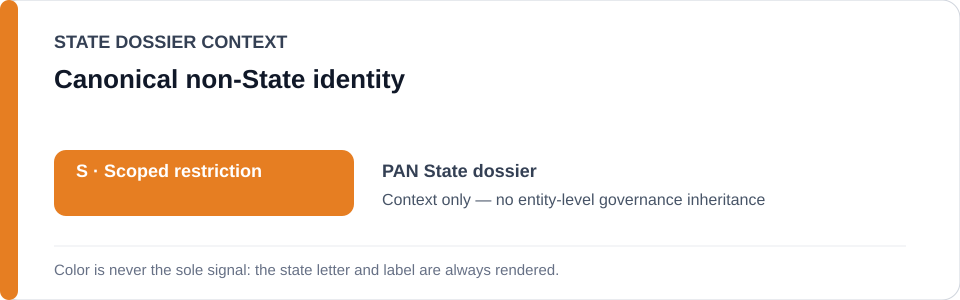
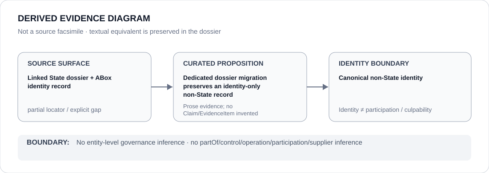

# Organization of American States

## Identity scope
Canonical identity `ORG-OAS`; ABox metadata remains authoritative.

## State governance context
`PAN` context is `S` only; no entity-level governance inheritance.

## Evidence record
Dedicated dossier migration only; no Claim, EvidenceItem, relation, participation or licensing effect is created.

## Attribution and exclusions
Identity or adjacency does not infer partOf, sameAs, control, operation, participation, supply, command, membership or culpability.

## Visual evidence

## Evidence gaps
Source granularity: `partial`; proposition-specific gaps remain open.

## Sources
- `knowledge/entities/ORG-OAS.json`
- `dossiers/states/PAN.md`

## Governance boundary
This dossier records identity and context only; it does not independently establish an ECL restriction.
