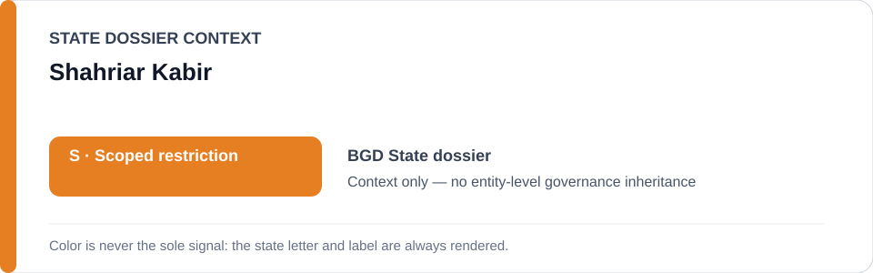
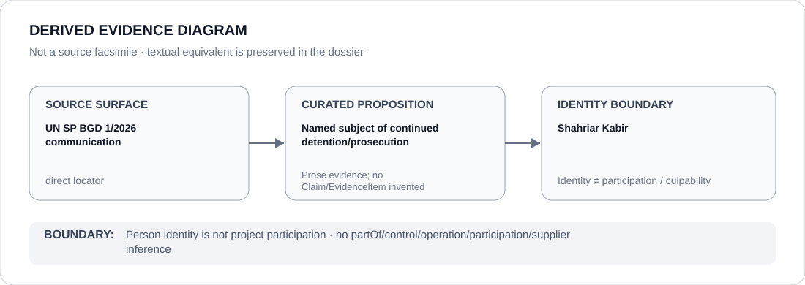

# Shahriar Kabir

> **Canonical per-entity evidence/provenance record.** This dossier has no licensing effect by itself and carries no standalone `provisional_outcome`.

## Identity scope

Shahriar Kabir, represented solely as the person named as the subject of the `BGD 1/2026` continued-detention/prosecution project. This record makes no finding about criminal culpability, political responsibility or participation in the coercive project.

## State governance context

The canonical `BGD` State dossier records **S — Scoped restriction** for anti-terrorism, cyber/ICT and political-association enforcement materially targeting protected journalism, expression or peaceful political activity. That `S` is context only and is not inherited by Shahriar Kabir.

## Evidence record

- The Bangladesh Schedule freeze defines the exact **BGD 1/2026 — Shahriar Kabir continued detention/prosecution project**.
- Its boundary is the continued detention and materially participating prosecution/custody processes concerning Kabir identified by UN Special Procedures communication `BGD 1/2026` and the Working Group on Arbitrary Detention opinion referenced there.
- The freeze expressly excludes Bangladesh anti-terrorism or criminal-justice enforcement generally, other journalists/cases and independent judicial review, release or remediation.

## Attribution and exclusions

Being the named detained/prosecuted person does not make Shahriar Kabir an operator, controller, supplier or culpable participant in the project. Attribution runs toward materially participating detention/prosecution functions, not back onto the person subjected to them.

## Visual evidence

The diagram links the direct `BGD 1/2026` communication to the limited subject-of-case proposition and then stops at the person-identity boundary.

## Evidence gaps

This dossier does not adjudicate underlying allegations, reconstruct the complete criminal file or generalize this named case to other Bangladesh journalists or anti-terrorism proceedings.

## Sources

- [UN Special Procedures — BGD 1/2026 communication](https://spcommreports.ohchr.org/TMResultsBase/DownLoadPublicCommunicationFile?gId=30869)
- [BGD named-case Schedule freeze](../../registry/schedule-state-s-freezes/batch-15b-bgd-freeze.yml)
- [Canonical Bangladesh State dossier](../states/BGD.md)

## Governance boundary

A person named as the subject of detention/prosecution does not inherit State governance, project responsibility, participation, culpability or Material Participation. The orange `S` is State context only.
