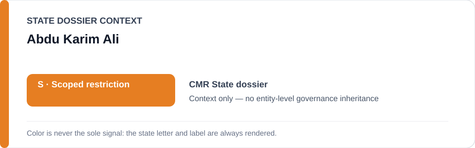
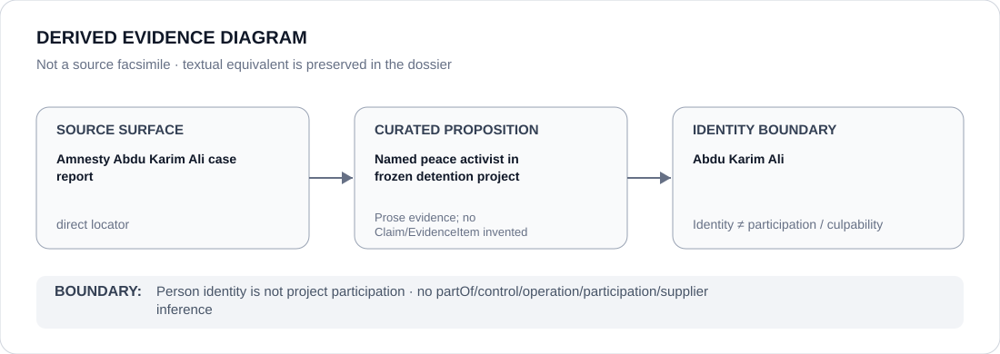

# Abdu Karim Ali

> **Canonical per-entity evidence/provenance record.** This dossier has no licensing effect by itself and carries no standalone `provisional_outcome`.

## Identity scope

Abdu Karim Ali, represented solely as the peace activist named in the continued-detention / Yaoundé Military Tribunal life-sentence project. Identity does not encode criminal culpability, project participation or a governance outcome.

## State governance context

The canonical `CMR` State dossier records **S — Scoped restriction** for identified election/protest security operations and military-court/detention projects materially used against protected political assembly or expression. That `S` is context only and is not inherited by Abdu Karim Ali.

## Evidence record

- The Cameroon freeze identifies the exact **Abdu Karim Ali detention / Yaoundé Military Tribunal life-sentence project**.
- Its boundary is continued detention and enforcement of the 16 April 2025 life sentence, including materially participating detention/prosecution functions.
- Amnesty's person-specific case report and Cameroon country report are retained as direct identity sources.
- The freeze excludes Cameroonian military courts, police and detention systems generally, independent appellate/remedial action and other detainees absent separate review.

## Attribution and exclusions

Being the activist whose detention and sentence define the case does not make Abdu Karim Ali a participant in the coercive project. No relation to detention, prosecution, military command or court operation is inferred from his identity.

## Visual evidence

The diagram records only that he is the named peace activist in the frozen case and terminates at the person-identity boundary.

## Evidence gaps

This identity dossier does not adjudicate the charges or reconstruct the complete trial/appellate record. Responsibility of any institutional actor remains proposition-specific and separately evidenced.

## Sources

- [Amnesty — Cameroon: life sentence for peace activist](https://www.amnesty.org/en/latest/news/2025/05/cameroon-life-sentence-peace-activist/)
- [CMR named-case Schedule freeze](../../registry/schedule-state-s-freezes/batch-08-case-projects.yml)
- [Canonical Cameroon State dossier](../states/CMR.md)

## Governance boundary

A peace activist named as the subject of detention/prosecution does not inherit State governance, project responsibility, participation, culpability or Material Participation. The orange `S` is State context only.
