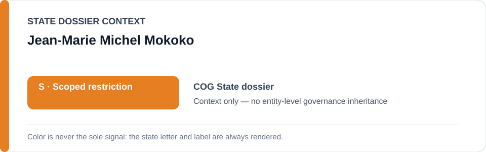
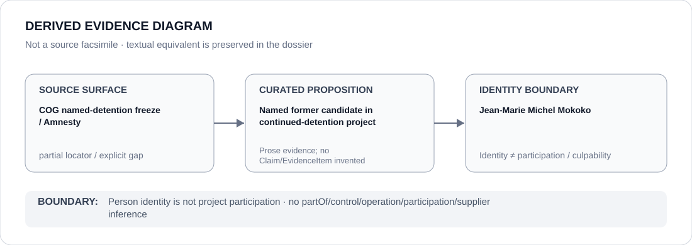

# Jean-Marie Michel Mokoko

> **Canonical per-entity evidence/provenance record.** This dossier has no licensing effect by itself and carries no standalone `provisional_outcome`.

## Identity scope

Jean-Marie Michel Mokoko, represented solely as one of the two former presidential candidates named in the Republic of Congo continued-political-detention freeze. Identity does not encode culpability, participation in the detention project or a governance outcome.

## State governance context

The canonical `COG` State dossier records **S — Scoped restriction** for political-security/public-order and detention projects materially carrying out arbitrary political detention or serious coercive repression. That `S` is context only and is not inherited by Jean-Marie Michel Mokoko.

## Evidence record

- The Congo Schedule freeze identifies **continued detention of Jean-Marie Michel Mokoko and André Okombi Salissa** as the exact renderable subset.
- Its boundary is the continued detention/enforcement processes concerning the two former presidential candidates identified in the current evidence record and prior UN arbitrary-detention finding.
- Republic of Congo detention/security institutions generally, other political cases and release/independent review/remediation are excluded.

## Attribution and exclusions

Being the former candidate whose detention defines the frozen case does not make Mokoko an operator, controller or culpable participant in the detention/enforcement project. Any institutional participation requires separate evidence.

## Visual evidence

The diagram records subject-of-case identity and terminates at the person boundary.

## Evidence gaps

The freeze names Mokoko directly but retains the Amnesty Congo country-report surface rather than a person-specific current case URL. Source granularity is therefore marked **partial**; this dossier does not reconstruct a more specific locator by inference.

## Sources

- [Amnesty — Republic of Congo country record](https://www.amnesty.org/en/location/africa/west-and-central-africa/congo/report-congo/)
- [COG named-detention Schedule freeze](../../registry/schedule-state-s-freezes/batch-12a-cog-freeze.yml)
- [Canonical Republic of Congo State dossier](../states/COG.md)

## Governance boundary

A former candidate named as the subject of detention does not inherit State governance, project responsibility, participation, culpability or Material Participation. The orange `S` is State context only.
