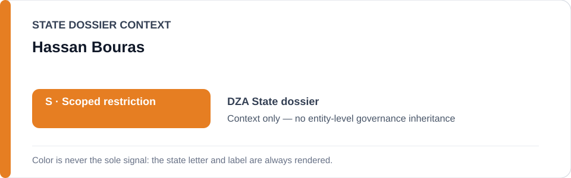
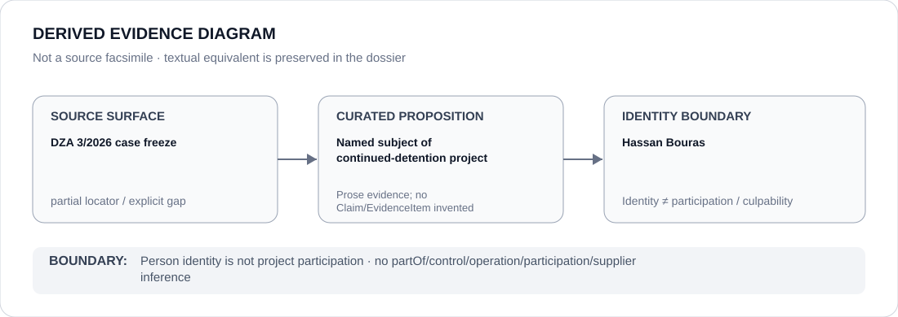

# Hassan Bouras

> **Canonical per-entity evidence/provenance record.** This dossier has no licensing effect by itself and carries no standalone `provisional_outcome`.

## Identity scope

Hassan Bouras, represented solely as the journalist/human-rights defender named as the subject of the Algeria detention case frozen as `DZA 3/2026`. This identity record makes no finding about criminal culpability, political affiliation or participation in the coercive project.

## State governance context

The canonical `DZA` State dossier currently records **S — Scoped restriction** for identified security/prosecutorial/judicial and administrative projects materially used to suppress protected journalism, human-rights defence and related activity. That `S` is context only and is not inherited by Hassan Bouras.

## Evidence record

- The Algeria State dossier identifies Hassan Bouras by name in its 2026 record of alleged arbitrary detention of journalists and defenders.
- The Schedule freeze defines the finite **Hassan Bouras detention project — DZA 3/2026 / El Haoud Prison, El Bayadh** and limits renderability to the continued detention and materially participating prosecution/detention processes concerning him.
- The freeze excludes Algerian justice/security institutions generally, unrelated prosecutions and independent remedial functions.

## Attribution and exclusions

Being the detained person at the centre of a case does not make Hassan Bouras a participant in, controller of, supplier to or culpable actor for that detention/prosecution project. The direction of attribution runs from materially participating institutional functions toward the case project, never from the case back onto its subject.

## Visual evidence

The diagram stops at the person-identity boundary and does not encode a relation edge from Hassan Bouras to the project.

## Evidence gaps

The freeze preserves the exact `DZA 3/2026` project identity, but its current `identity_sources` entry is a generic UN Special Procedures mandates locator rather than a proposition-specific `DZA 3/2026` communication URL. This dossier therefore marks source granularity as **partial** instead of inventing a more precise locator.

## Sources

- [Canonical Algeria State dossier](../states/DZA.md)
- [DZA named-case Schedule freeze](../../registry/schedule-state-s-freezes/batch-08-case-projects.yml)
- [UN Special Procedures mandates surface preserved by the freeze](https://spcommreports.ohchr.org/TmSearch/Mandates?m=44)

## Governance boundary

A person named as the subject of detention or prosecution does not inherit State governance, project responsibility, participation, culpability or Material Participation. The orange `S` is State context only.
