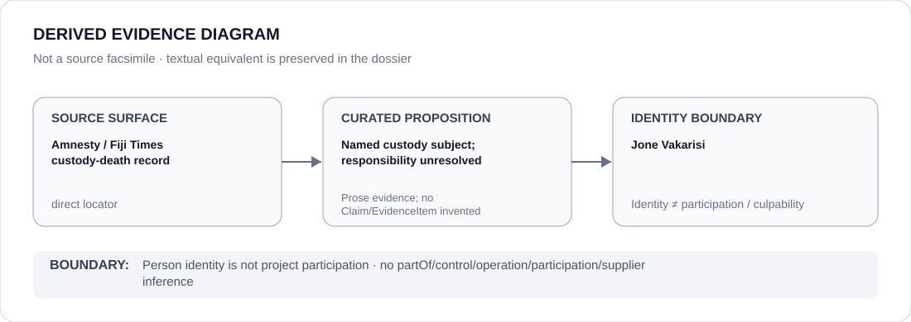

# Jone Vakarisi

> **Canonical per-entity evidence/provenance record.** This dossier has no licensing effect by itself and carries no standalone `provisional_outcome`.

## Identity scope

Jone Vakarisi, represented solely as the person who died after being taken into military custody on 16–17 April 2026. This dossier records subject-of-incident identity and does not assign responsibility for his death to him or to any other actor.

## State governance context

The canonical `FJI` State dossier currently records **U — Under Review** because the grave custody allegations remain subject to active police/coronial investigation and unresolved attribution. That `U` is context only and is not inherited by Jone Vakarisi.

## Evidence record

- The Fiji dossier records that Vakarisi died after being taken to Queen Elizabeth Barracks for questioning.
- Amnesty called for prompt investigation; the Fiji Times later documented the investigation's final phase and requests to interview identified military personnel.
- The State review downgraded the earlier `S` to `U` because responsibility, project boundary and remediation remained unresolved while active independent investigative processes were materially functioning.

## Attribution and exclusions

Jone Vakarisi is the subject/deceased person in the incident, not a participant in the alleged coercive custody project. His identity cannot establish responsibility by RFMF, police, investigators or any individual; those propositions require separate evidence.

## Visual evidence

The diagram preserves the direct custody-death provenance while explicitly retaining unresolved responsibility.

## Evidence gaps

The independent investigation had not reached a final responsibility/accountability determination at the dossier cutoff. This dossier therefore does not infer perpetrators, obstruction, recurrence or an institutional project beyond what the State review supports.

## Sources

- [Amnesty — death in military custody must be investigated](https://www.amnesty.org/en/latest/news/2026/04/fiji-death-of-man-in-military-custody-must-be-promptly-investigated/)
- [Fiji Times — final phase in Vakarisi investigation](https://www.fijitimes.com.fj/final-phase-in-probe-vakarisi-case-rfmf-interview-approval-sought/)
- [Canonical Fiji State dossier](../states/FJI.md)

## Governance boundary

A deceased or detained person does not inherit State governance, project responsibility, participation, culpability or Material Participation. The amber `U` is State context only.
