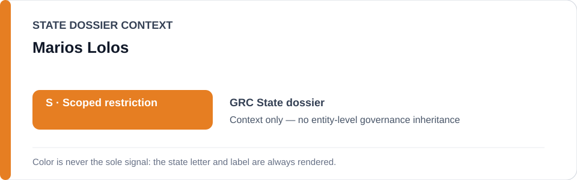
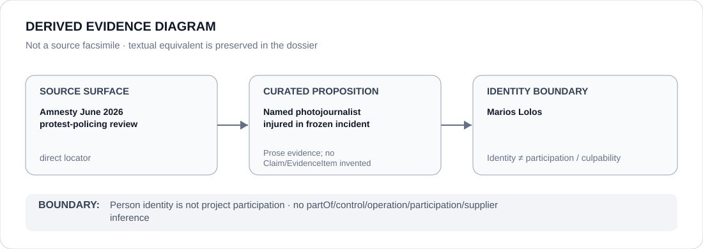

# Marios Lolos

> **Canonical per-entity evidence/provenance record.** This dossier has no licensing effect by itself and carries no standalone `provisional_outcome`.

## Identity scope

Marios Lolos, represented solely as the photojournalist named in the 26 January 2025 Athens Tempi-demonstration stun-grenade incident and its continuing accountability process. Identity is not a governance, participation or culpability finding.

## State governance context

The canonical `GRC` State dossier records **S — Scoped restriction** for identified public-order/protest-policing operations and freezes only the exact Lolos incident/accountability project as currently Schedule-renderable. That `S` is context only and is not inherited by Marios Lolos.

## Evidence record

- Amnesty's June 2026 review records that Lolos was struck in the head by a stun grenade while covering the Athens Tempi demonstration, suffering permanent hearing loss and a head injury.
- The Greece dossier records verified video corroboration and an allegation of deliberate targeting.
- Lolos had lodged an EMIDIPA complaint; criminal and disciplinary investigations remained active. Those accountability functions are expressly excluded from the frozen coercive project.

## Attribution and exclusions

Marios Lolos is the journalist subjected to the incident, not an operator or participant in the protest-policing project. His complaint and presence at the demonstration create no culpability, command, control or Material Participation relation.

## Visual evidence

The diagram identifies the direct Amnesty incident record, the bounded proposition concerning the named photojournalist and the person-identity boundary.

## Evidence gaps

The current accountability process had not produced a final durable-remediation determination at cutoff. This dossier does not infer individual police responsibility beyond the evidence preserved by the canonical Greece dossier and freeze.

## Sources

- [Amnesty — Greece protest-policing review](https://www.amnesty.org/en/documents/eur25/1012/2026/en/)
- [Amnesty — dangerous policing tactics in Greece](https://www.amnesty.org/en/latest/news/2026/06/greece-dangerous-policing-tactics-have-turned-peaceful-protests-into-battlefields/)
- [Canonical Greece State dossier](../states/GRC.md)
- [GRC named-incident Schedule freeze](../../registry/schedule-state-s-freezes/batch-21b-grc-freeze.yml)

## Governance boundary

A journalist injured in a policing incident does not inherit State governance, project responsibility, participation, culpability or Material Participation. The orange `S` is State context only.
