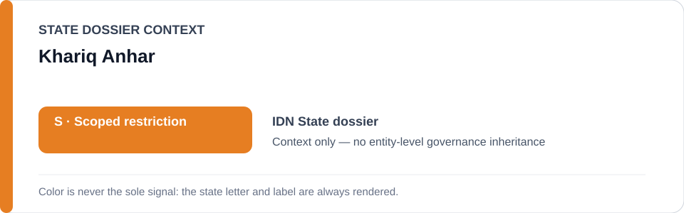
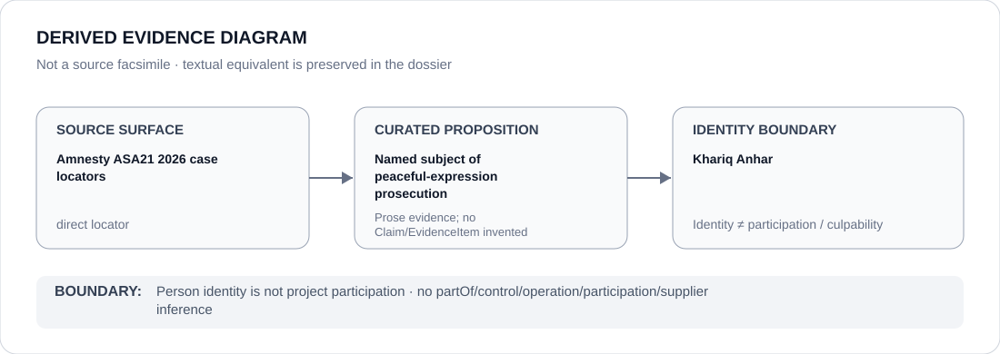

# Khariq Anhar

> **Canonical per-entity evidence/provenance record.** This dossier has no licensing effect by itself and carries no standalone `provisional_outcome`.

## Identity scope

Khariq Anhar, represented solely as the person named in the EIT-law prosecution concerning a satirical social-media post linked to the August 2025 protest cycle. This record does not adjudicate culpability and does not make him a participant in the prosecution project.

## State governance context

The canonical `IDN` State dossier records **S — Scoped restriction** for specified peaceful-protest criminalization and other materially implemented coercive projects. That `S` is context only and is not inherited by Khariq Anhar.

## Evidence record

- The Indonesia freeze defines the exact **Khariq Anhar EIT-law prosecution project**.
- Its boundary is the continued prosecution concerning protected satirical expression documented on 22 July 2026.
- Two exact Amnesty 2026 locators are retained for the named case.
- Indonesia's EIT law generally, other protest cases and acquitting/remedial courts are expressly excluded.

## Attribution and exclusions

Being the defendant/subject of an expression prosecution does not establish operation, participation, control, supply or culpability for that prosecutorial project. Any institutional participation requires separate evidence.

## Visual evidence

The diagram links the direct Amnesty case provenance to the limited proposition that Anhar is the named subject of the peaceful-expression prosecution.

## Evidence gaps

This dossier does not reconstruct the full Indonesian case file, adjudicate the EIT-law allegations or generalize from Anhar's case to other protest, information-control, military or Papua projects.

## Sources

- [Amnesty — ASA21/1300/2026](https://www.amnesty.org/en/documents/asa21/1300/2026/en/)
- [Amnesty — ASA21/0624/2026](https://www.amnesty.org/en/documents/asa21/0624/2026/en/)
- [IDN named-case Schedule freeze](../../registry/schedule-state-s-freezes/batch-10b-idn-freeze.yml)
- [Canonical Indonesia State dossier](../states/IDN.md)

## Governance boundary

A person named as the subject of prosecution does not inherit State governance, project responsibility, participation, culpability or Material Participation. The orange `S` is State context only.
